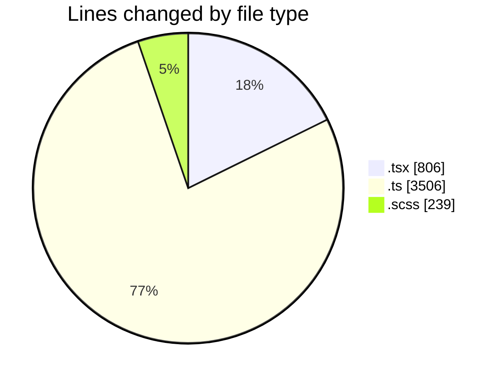
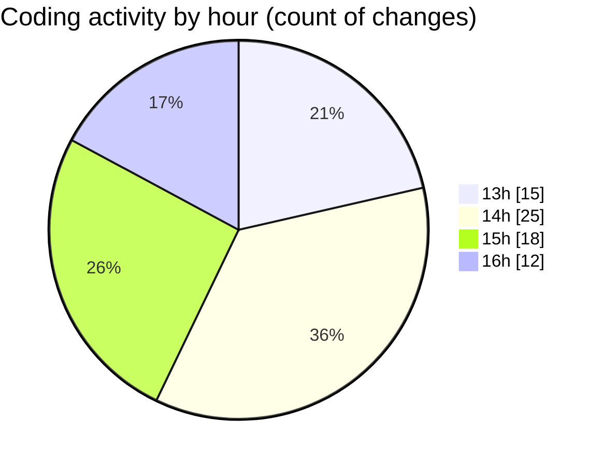

# cda - Activity Summary 

## Overall Statistics

| Stat                   | Value                                                             |
| ---------------------- | ----------------------------------------------------------------- |
| **Lines Added** (➕)   | 4457                                          |
| **Lines Removed** (➖) | 94                                        |
| **Net Change** (↕)    | 4363                |
| **Active Time** (⌚)   | 92 minutes |

## Modified Files
- **Home.tsx** (+532, -19)
- **emails.ts** (+196, -0)
- **calendar-mutations.ts** (+3143, -0)
- **ScrollableDatepicker.scss** (+198, -41)
- **ScrollableDatepicker.tsx** (+160, -34)
- **index.tsx** (+61, -0)
- **comments.ts** (+167, -0)

## Visualizations

### By File Type (Lines Changed)

### By Hour (Estimated Activity Count)

> **Last Updated:** 17/09/2025, 16:49:38