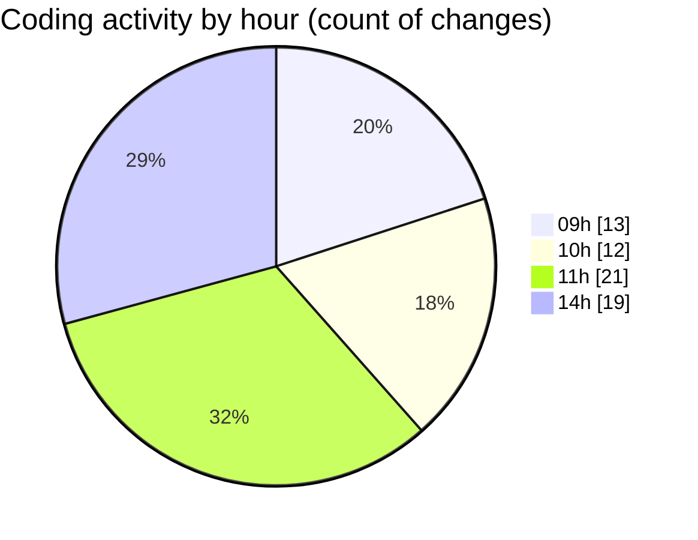

# cda - Activity Summary 

## Overall Statistics

| Stat                   | Value                                                             |
| ---------------------- | ----------------------------------------------------------------- |
| **Lines Added** (➕)   | 15266                                          |
| **Lines Removed** (➖) | 2044                                        |
| **Net Change** (↕)    | 13222                |
| **Active Time** (⌚)   | 84 minutes |

## Modified Files
- **ScrollableDatepicker.tsx** (+358, -44)
- **Home.tsx** (+256, -36)
- **calendar.ts** (+954, -7)
- **emails.ts** (+218, -22)
- **events.ts** (+110, -0)
- **calendar-queries.ts** (+1500, -0)
- **calendar-mutations.ts** (+3148, -5)
- **EventForm.tsx** (+1126, -24)
- **graphql.ts** (+7218, -1886)
- **EventCard.test.tsx** (+317, -20)
- **index.tsx** (+61, -0)

## Visualizations

### By File Type (Lines Changed)

### By Hour (Estimated Activity Count)

> **Last Updated:** 22/09/2025, 14:32:49