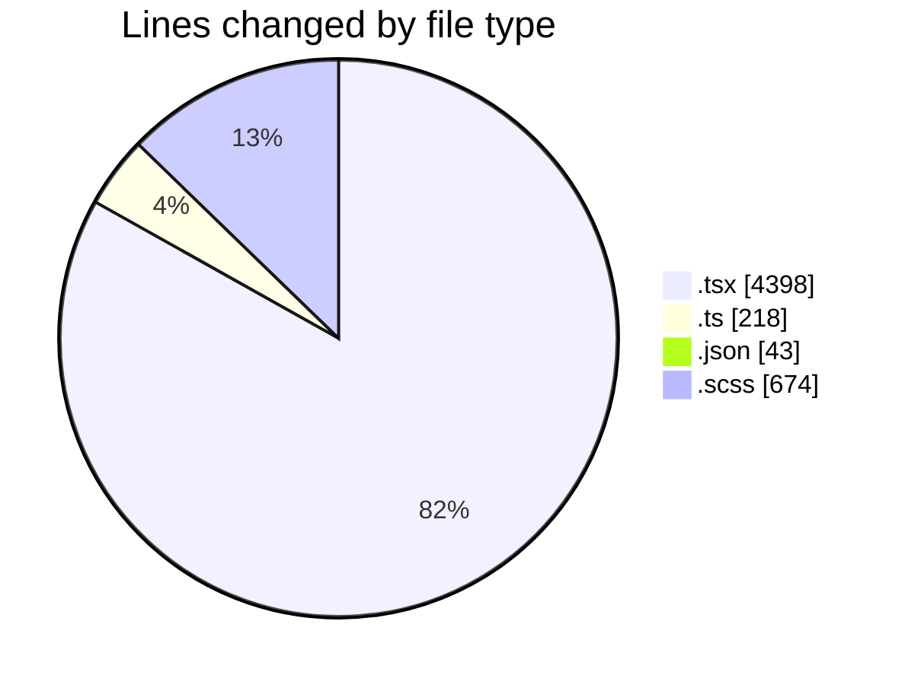
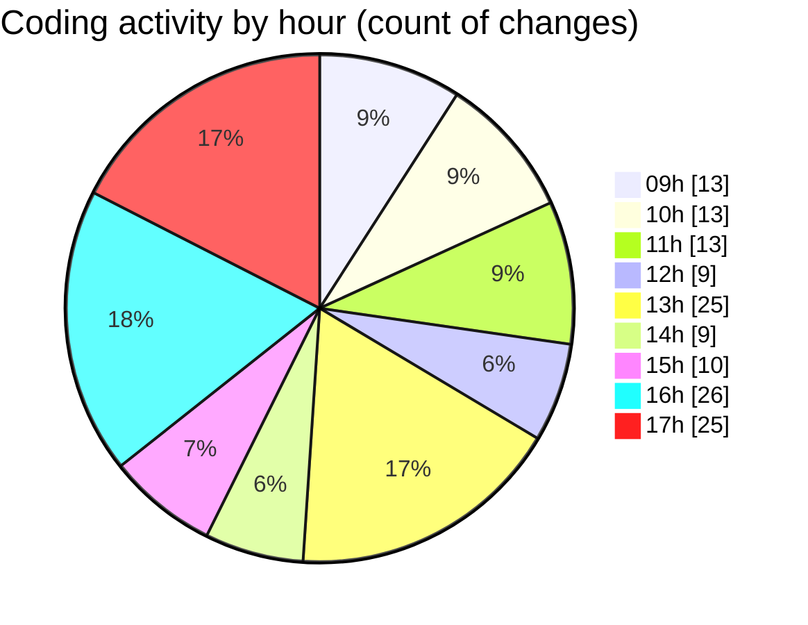

# cda - Activity Summary 

## Overall Statistics

| Stat                   | Value                                                             |
| ---------------------- | ----------------------------------------------------------------- |
| **Lines Added** (➕)   | 4028                                          |
| **Lines Removed** (➖) | 1305                                        |
| **Net Change** (↕)    | 2723                |
| **Active Time** (⌚)   | 195 minutes |

## Modified Files
- **EventForm.tsx** (+235, -239)
- **EventPage.tsx** (+840, -0)
- **EventForm.test.tsx** (+1430, -588)
- **eventForm.ts** (+78, -31)
- **eventForm.test.ts** (+97, -0)
- **DeleteEventModal.tsx** (+100, -7)
- **settings.json** (+43, -0)
- **EventModal.test.tsx** (+127, -0)
- **index.ts** (+6, -0)
- **EventModal.tsx** (+298, -101)
- **index.ts** (+3, -0)
- **EventModal.scss** (+358, -316)
- **DeleteEventWrapper.test.tsx** (+254, -0)
- **index.ts** (+3, -0)
- **DeleteEventWrapper.tsx** (+156, -23)

## Visualizations

### By File Type (Lines Changed)

### By Hour (Estimated Activity Count)

> **Last Updated:** 23/09/2025, 17:09:52