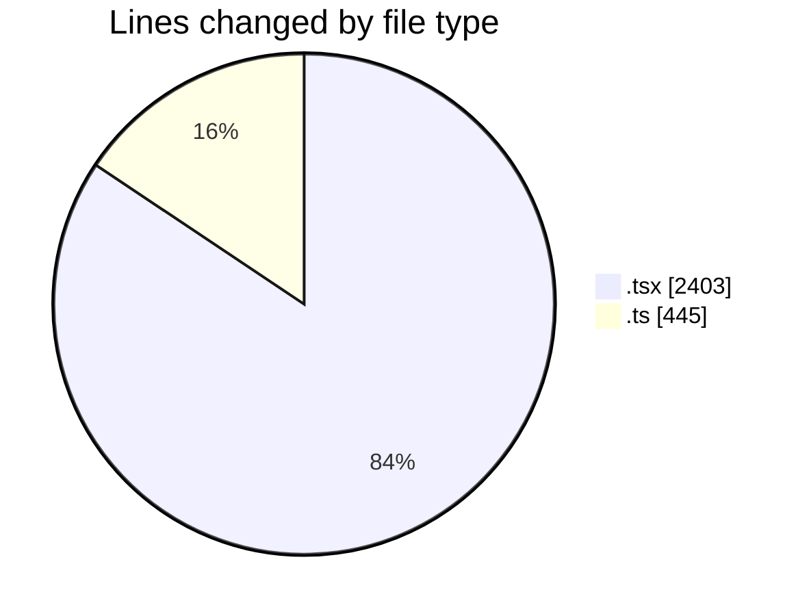
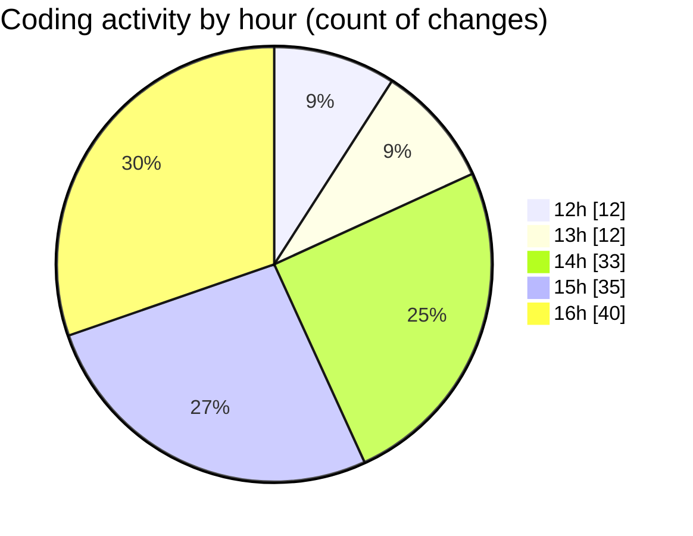

# cda - Activity Summary 

## Overall Statistics

| Stat                   | Value                                                             |
| ---------------------- | ----------------------------------------------------------------- |
| **Lines Added** (➕)   | 2513                                          |
| **Lines Removed** (➖) | 335                                        |
| **Net Change** (↕)    | 2178                |
| **Active Time** (⌚)   | 189 minutes |

## Modified Files
- **CopyEventWrapper.tsx** (+63, -4)
- **EventForm.tsx** (+1118, -21)
- **EventPage.tsx** (+429, -7)
- **mapEventTypeToForm.ts** (+49, -0)
- **eventForm.ts** (+47, -31)
- **mapEventToForm.ts** (+78, -12)
- **stripOwner.ts** (+6, -0)
- **mapEventToForm.test.ts** (+103, -16)
- **eventForm.test.ts** (+98, -5)
- **DeleteEventWrapper.test.tsx** (+330, -204)
- **ProviderRouterTest.tsx** (+56, -1)
- **CopyEventWrapper.test.tsx** (+136, -34)

## Visualizations

### By File Type (Lines Changed)

### By Hour (Estimated Activity Count)

> **Last Updated:** 24/09/2025, 16:43:27