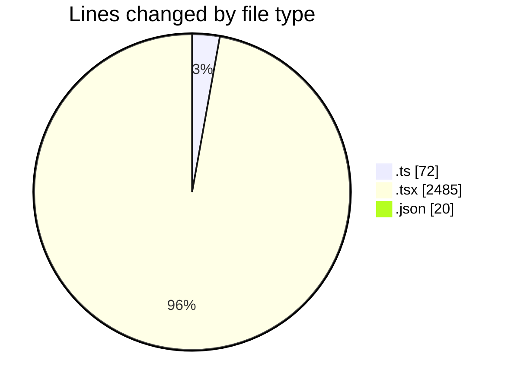
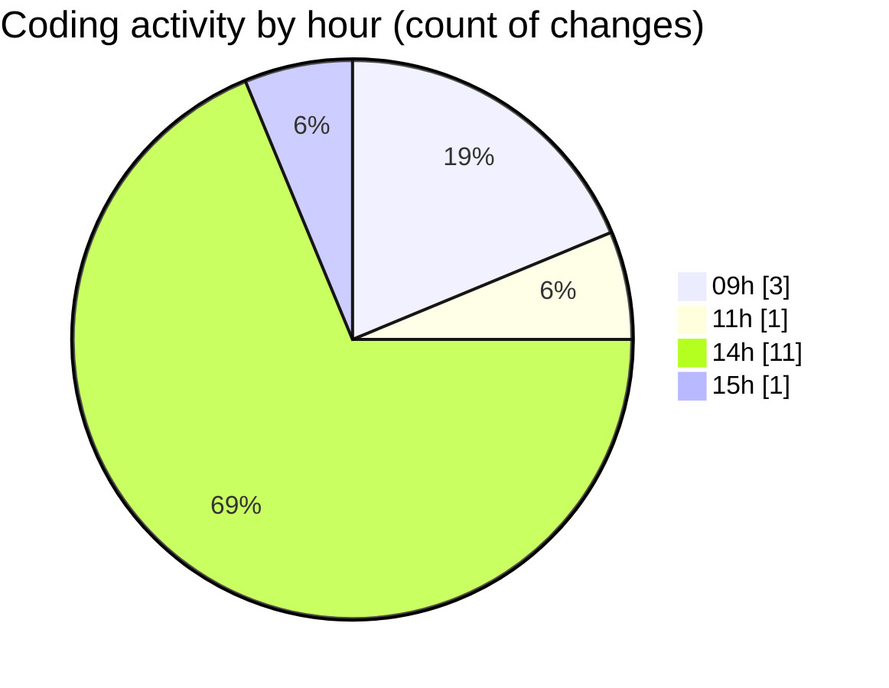

# cda - Activity Summary 

## Overall Statistics

| Stat                   | Value                                                             |
| ---------------------- | ----------------------------------------------------------------- |
| **Lines Added** (➕)   | 2561                                          |
| **Lines Removed** (➖) | 16                                        |
| **Net Change** (↕)    | 2545                |
| **Active Time** (⌚)   | 9 minutes |

## Modified Files
- **mapEventToForm.ts** (+66, -0)
- **EventPage.test.tsx** (+0, -16)
- **EventModal.tsx** (+73, -0)
- **index.ts** (+3, -0)
- **CopyEventWrapper.test.tsx** (+100, -0)
- **EventPage.tsx** (+842, -0)
- **index.ts** (+3, -0)
- **DuplicateEventWrapper.tsx** (+29, -0)
- **DuplicateEventWrapper.test.tsx** (+200, -0)
- **EventForm.test.tsx** (+842, -0)
- **Record.tsx** (+226, -0)
- **tsconfig.json** (+20, -0)
- **MediaUploader.tsx** (+157, -0)

## Visualizations

### By File Type (Lines Changed)

### By Hour (Estimated Activity Count)

> **Last Updated:** 25/09/2025, 15:02:47