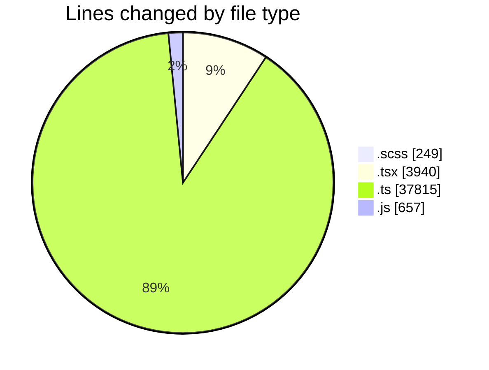
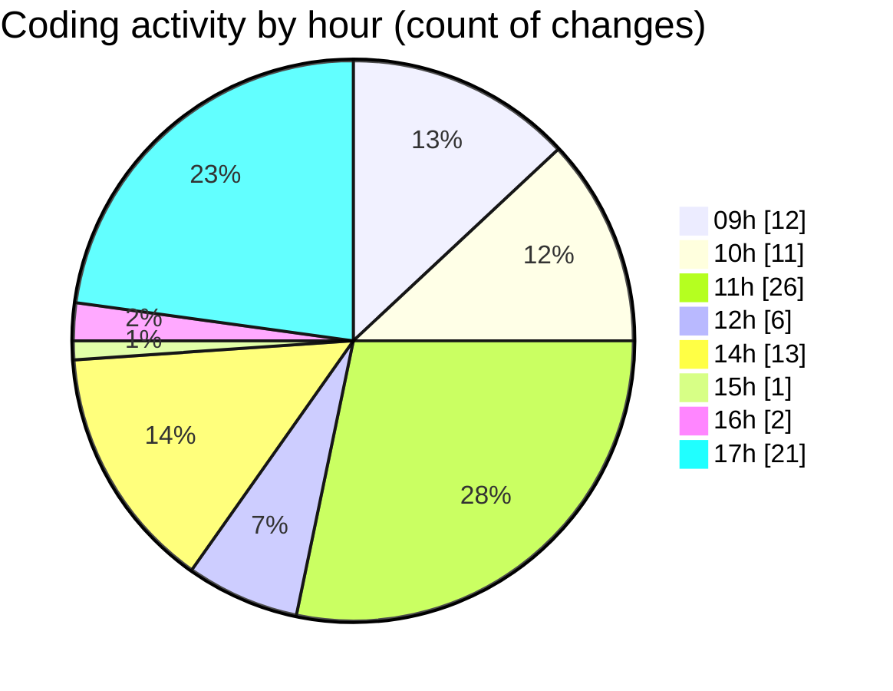

# cda - Activity Summary 

## Overall Statistics

| Stat                   | Value                                                             |
| ---------------------- | ----------------------------------------------------------------- |
| **Lines Added** (➕)   | 41229                                          |
| **Lines Removed** (➖) | 1432                                        |
| **Net Change** (↕)    | 39797                |
| **Active Time** (⌚)   | 125 minutes |

## Modified Files
- **EventPage.scss** (+249, -0)
- **index.tsx** (+84, -0)
- **EventForm.tsx** (+2236, -1125)
- **mapEventToForm.ts** (+72, -6)
- **DuplicateEventWrapper.tsx** (+52, -23)
- **EventPage.tsx** (+420, -0)
- **20250926111516-create-calendar-media-table.js** (+23, -3)
- **20250926132109-replace-calendar-events-view.js** (+100, -1)
- **tables.ts** (+5880, -0)
- **views.ts** (+8640, -0)
- **calendar.js** (+333, -11)
- **calendar.ts** (+1155, -105)
- **resolvers-types.ts** (+9254, -71)
- **20250926132109-create-calendar-medi-view.js** (+99, -87)
- **resolvers-types.ts** (+12632, -0)

## Visualizations

### By File Type (Lines Changed)

### By Hour (Estimated Activity Count)

> **Last Updated:** 26/09/2025, 17:56:56