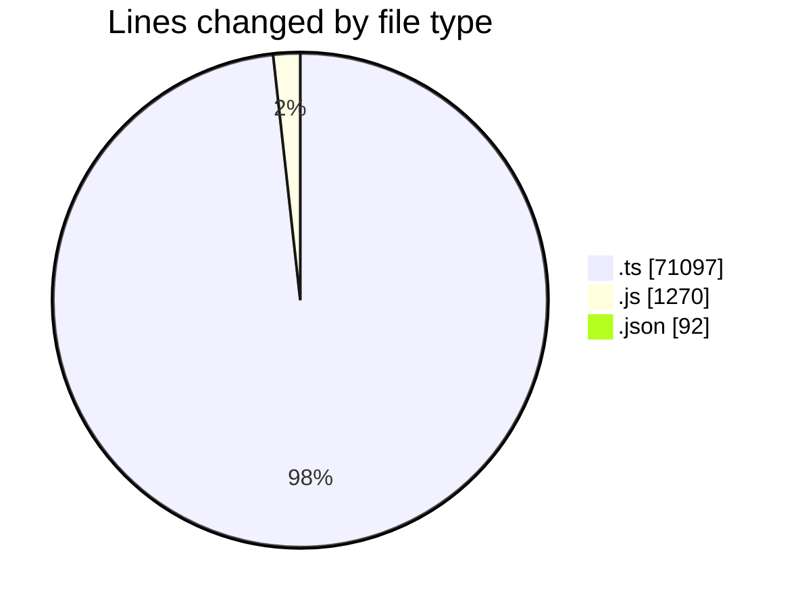
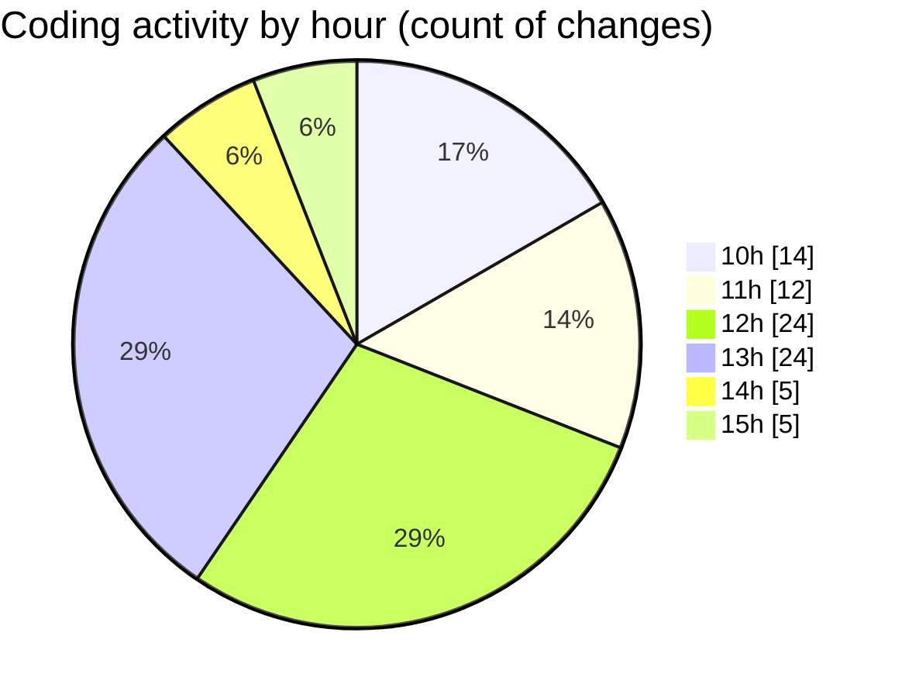

# cda - Activity Summary 

## Overall Statistics

| Stat                   | Value                                                             |
| ---------------------- | ----------------------------------------------------------------- |
| **Lines Added** (➕)   | 72199                                          |
| **Lines Removed** (➖) | 260                                        |
| **Net Change** (↕)    | 71939                |
| **Active Time** (⌚)   | 132 minutes |

## Modified Files
- **resolvers-types.ts** (+25260, -0)
- **resolvers-types.ts** (+18568, -0)
- **calendar.js** (+693, -1)
- **calendar.ts** (+1912, -110)
- **tables.ts** (+5880, -0)
- **views.ts** (+8640, -0)
- **calendar.ts** (+1012, -70)
- **calendar.js** (+346, -6)
- **calendar-mutations.ts** (+6509, -71)
- **calendar-queries.ts** (+3064, -1)
- **settings.json** (+91, -1)
- **index.js** (+224, -0)

## Visualizations

### By File Type (Lines Changed)

### By Hour (Estimated Activity Count)

> **Last Updated:** 29/09/2025, 15:44:49