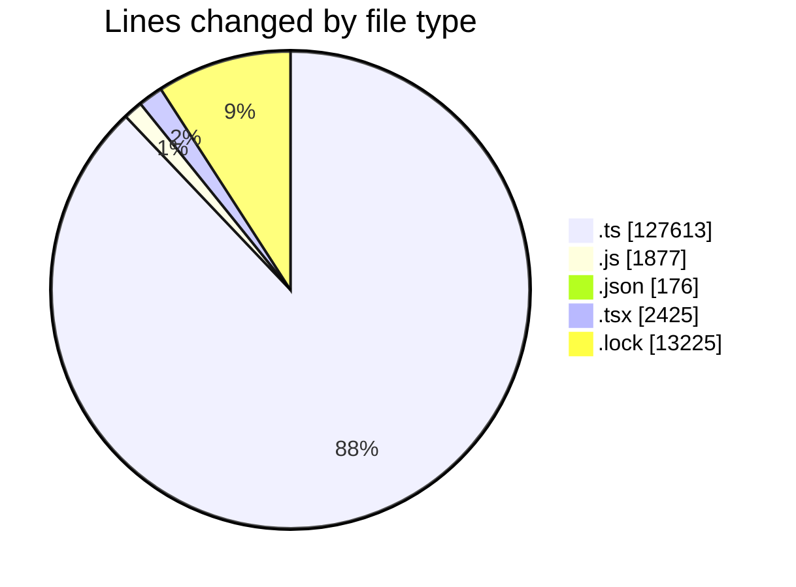
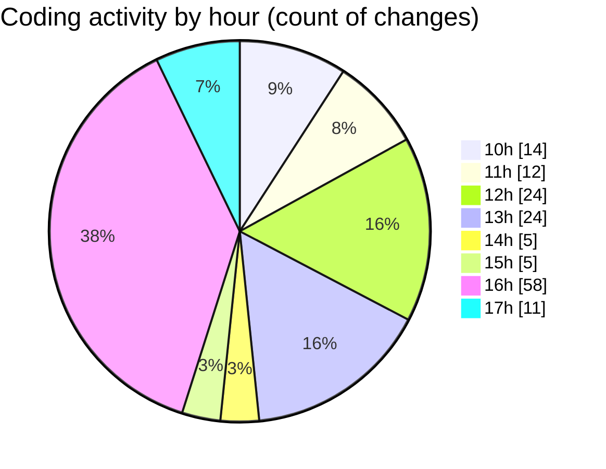

# cda - Activity Summary 

## Overall Statistics

| Stat                   | Value                                                             |
| ---------------------- | ----------------------------------------------------------------- |
| **Lines Added** (➕)   | 144244                                          |
| **Lines Removed** (➖) | 1072                                        |
| **Net Change** (↕)    | 143172                |
| **Active Time** (⌚)   | 224 minutes |

## Modified Files
- **resolvers-types.ts** (+25260, -0)
- **resolvers-types.ts** (+18568, -0)
- **calendar.js** (+693, -1)
- **calendar.ts** (+1912, -110)
- **tables.ts** (+5880, -0)
- **views.ts** (+8640, -0)
- **calendar.ts** (+2158, -274)
- **calendar.js** (+737, -76)
- **calendar-mutations.ts** (+9936, -284)
- **calendar-queries.ts** (+4596, -1)
- **settings.json** (+91, -1)
- **index.js** (+224, -0)
- **20250929145929-delete-event-file-table.js** (+17, -6)
- **20250926132109-create-calendar-media-view.js** (+12, -0)
- **20250929150037-delete-event-file-view.js** (+12, -1)
- **20250929145929-delete-calendar-file-table.js** (+11, -0)
- **20250929151450-delete-calendar-file-table.js** (+17, -16)
- **20250929150037-delete-calendar-file-view.js** (+21, -10)
- **20250929151848-delete-calendar-file-table.js** (+17, -6)
- **resolvers-types.ts** (+12630, -0)
- **tables.ts** (+5970, -107)
- **resolvers-types.ts** (+9282, -62)
- **views.ts** (+8739, -116)
- **EventForm.test.tsx** (+921, -0)
- **EventPage.tsx** (+422, -0)
- **EventForm.tsx** (+1082, -0)
- **index.ts** (+202, -0)
- **graphql.ts** (+7019, -0)
- **index.ts** (+278, -1)
- **gql.ts** (+168, -0)
- **graphql.ts** (+5420, -0)
- **package.json** (+84, -0)
- **yarn.lock** (+13225, -0)

## Visualizations

### By File Type (Lines Changed)

### By Hour (Estimated Activity Count)

> **Last Updated:** 29/09/2025, 17:19:49