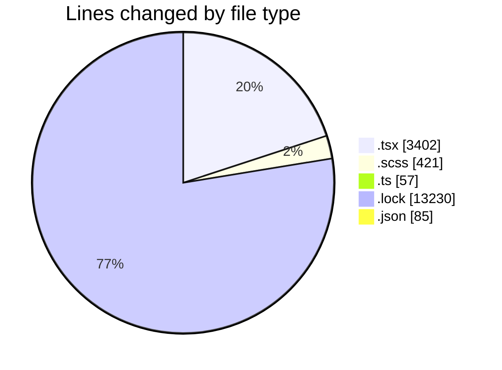
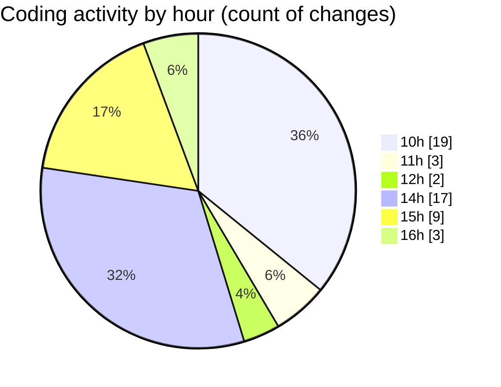

# cda - Activity Summary 

## Overall Statistics

| Stat                   | Value                                                             |
| ---------------------- | ----------------------------------------------------------------- |
| **Lines Added** (➕)   | 17145                                          |
| **Lines Removed** (➖) | 50                                        |
| **Net Change** (↕)    | 17095                |
| **Active Time** (⌚)   | 86 minutes |

## Modified Files
- **MediaUploader.tsx** (+367, -14)
- **EventPage.tsx** (+457, -25)
- **MediaUploader.scss** (+154, -0)
- **index.tsx** (+122, -0)
- **EventPage.scss** (+263, -4)
- **EventPage.test.tsx** (+1487, -7)
- **eventFaker.ts** (+57, -0)
- **EventForm.test.tsx** (+923, -0)
- **yarn.lock** (+13230, -0)
- **package.json** (+85, -0)

## Visualizations

### By File Type (Lines Changed)

### By Hour (Estimated Activity Count)

> **Last Updated:** 01/10/2025, 16:55:25