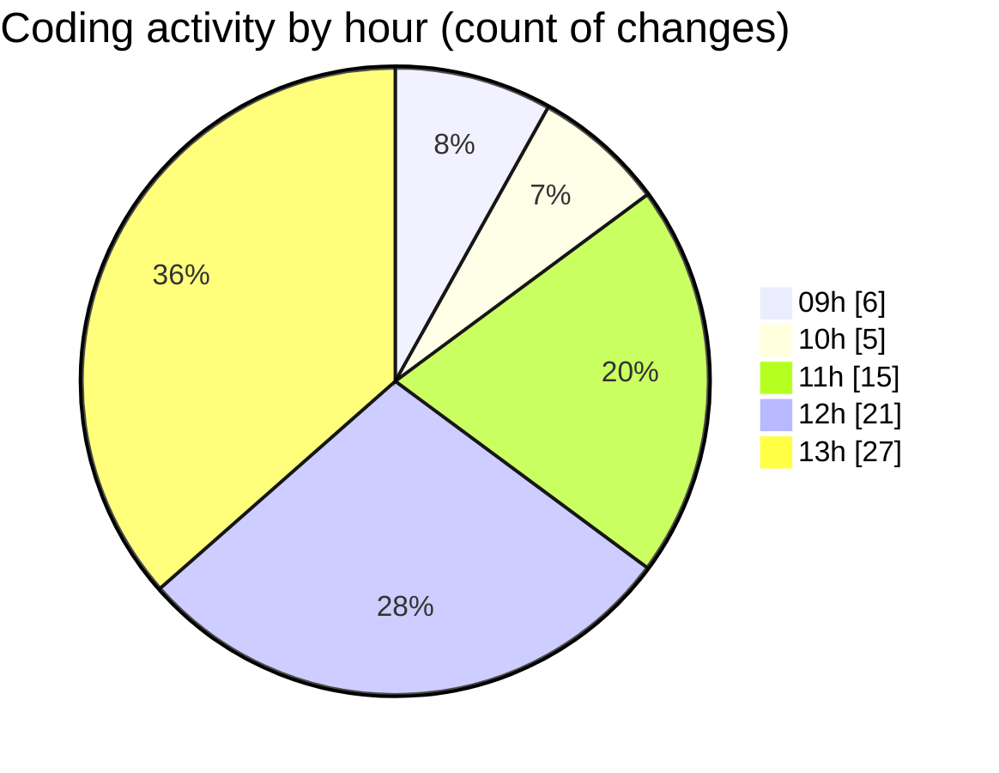

# cda - Activity Summary 

## Overall Statistics

| Stat                   | Value                                                             |
| ---------------------- | ----------------------------------------------------------------- |
| **Lines Added** (➕)   | 3090                                          |
| **Lines Removed** (➖) | 1208                                        |
| **Net Change** (↕)    | 1882                |
| **Active Time** (⌚)   | 112 minutes |

## Modified Files
- **EventForm.tsx** (+1130, -1132)
- **settings.json** (+51, -0)
- **tsconfig.json** (+21, -1)
- **MediaUploader.tsx** (+59, -65)
- **index.tsx** (+4, -4)
- **EventPage.tsx** (+432, -0)
- **EventForm.test.tsx** (+923, -0)
- **EventPage.scss** (+259, -0)
- **eventFaker.ts** (+57, -0)
- **MediaUploader.scss** (+154, -6)

## Visualizations

### By File Type (Lines Changed)

### By Hour (Estimated Activity Count)

> **Last Updated:** 02/10/2025, 13:18:37