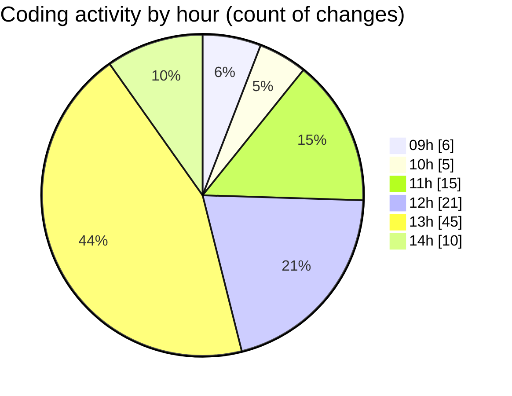

# cda - Activity Summary 

## Overall Statistics

| Stat                   | Value                                                             |
| ---------------------- | ----------------------------------------------------------------- |
| **Lines Added** (➕)   | 3136                                          |
| **Lines Removed** (➖) | 1228                                        |
| **Net Change** (↕)    | 1908                |
| **Active Time** (⌚)   | 161 minutes |

## Modified Files
- **EventForm.tsx** (+1130, -1132)
- **settings.json** (+51, -0)
- **tsconfig.json** (+21, -1)
- **MediaUploader.tsx** (+99, -85)
- **index.tsx** (+4, -4)
- **EventPage.tsx** (+432, -0)
- **EventForm.test.tsx** (+923, -0)
- **EventPage.scss** (+259, -0)
- **eventFaker.ts** (+57, -0)
- **MediaUploader.scss** (+160, -6)

## Visualizations

### By File Type (Lines Changed)

### By Hour (Estimated Activity Count)

> **Last Updated:** 02/10/2025, 14:13:37