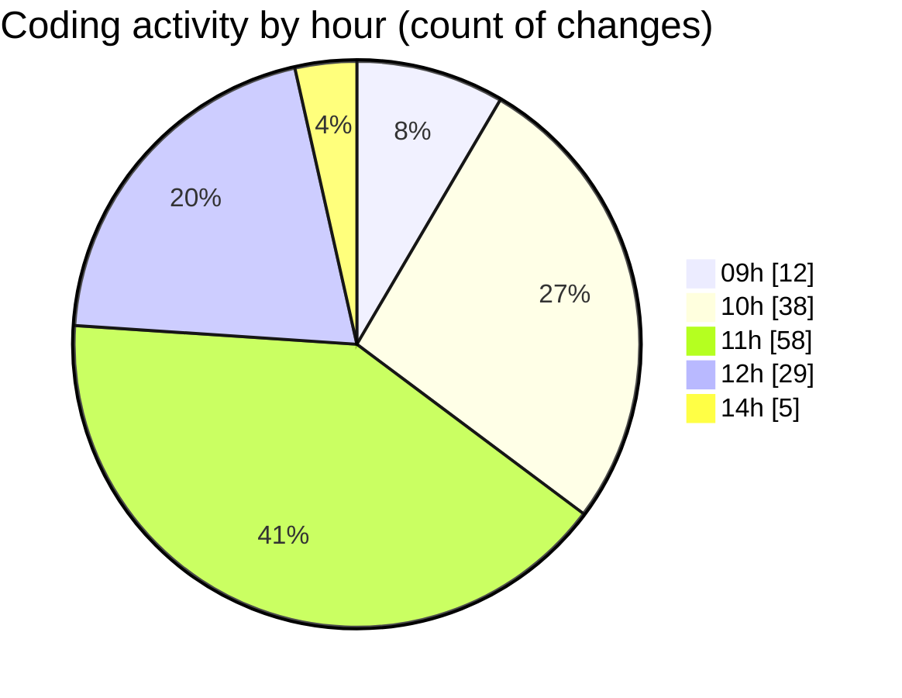

# cda - Activity Summary 

## Overall Statistics

| Stat                   | Value                                                             |
| ---------------------- | ----------------------------------------------------------------- |
| **Lines Added** (➕)   | 17279                                          |
| **Lines Removed** (➖) | 518                                        |
| **Net Change** (↕)    | 16761                |
| **Active Time** (⌚)   | 182 minutes |

## Modified Files
- **MediaUploader.tsx** (+361, -75)
- **MediaUploade.test.tsx** (+270, -146)
- **EventForm.tsx** (+1226, -62)
- **index.tsx** (+57, -0)
- **MediaUploader.scss** (+369, -225)
- **EventPage.tsx** (+442, -10)
- **package.json** (+85, -0)
- **EventPage.scss** (+259, -0)
- **EventForm.test.tsx** (+923, -0)
- **yarn.lock** (+13230, -0)
- **eventFaker.ts** (+57, -0)

## Visualizations

### By File Type (Lines Changed)

### By Hour (Estimated Activity Count)

> **Last Updated:** 03/10/2025, 14:41:47