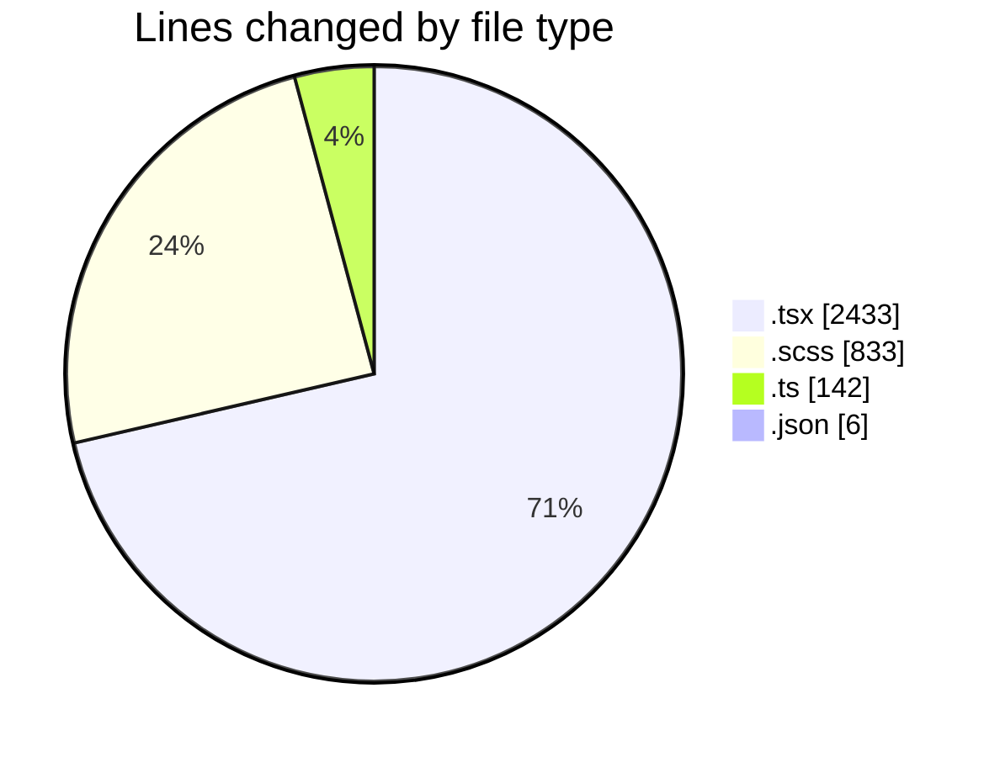
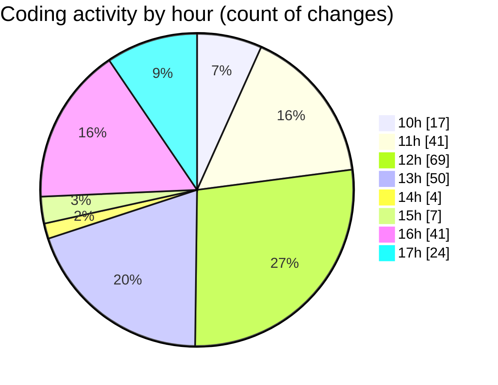

# cda - Activity Summary 

## Overall Statistics

| Stat                   | Value                                                             |
| ---------------------- | ----------------------------------------------------------------- |
| **Lines Added** (➕)   | 2923                                          |
| **Lines Removed** (➖) | 491                                        |
| **Net Change** (↕)    | 2432                |
| **Active Time** (⌚)   | 390 minutes |

## Modified Files
- **EventPage.tsx** (+448, -6)
- **EventPage.scss** (+361, -92)
- **MediaUploader.tsx** (+322, -185)
- **MediaUploade.test.tsx** (+213, -93)
- **MediaUploader.scss** (+290, -90)
- **normaliseImage.ts** (+43, -0)
- **settings.json** (+4, -2)
- **EventForm.tsx** (+1164, -2)
- **processImage.ts** (+78, -21)

## Visualizations

### By File Type (Lines Changed)

### By Hour (Estimated Activity Count)

> **Last Updated:** 06/10/2025, 17:22:41