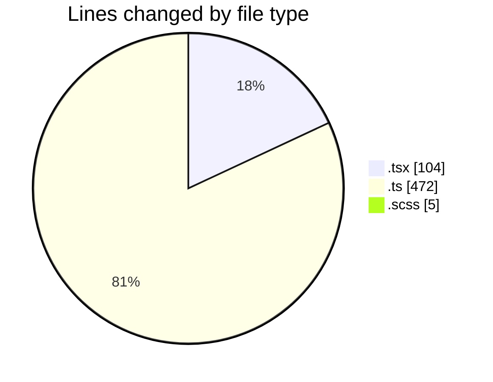
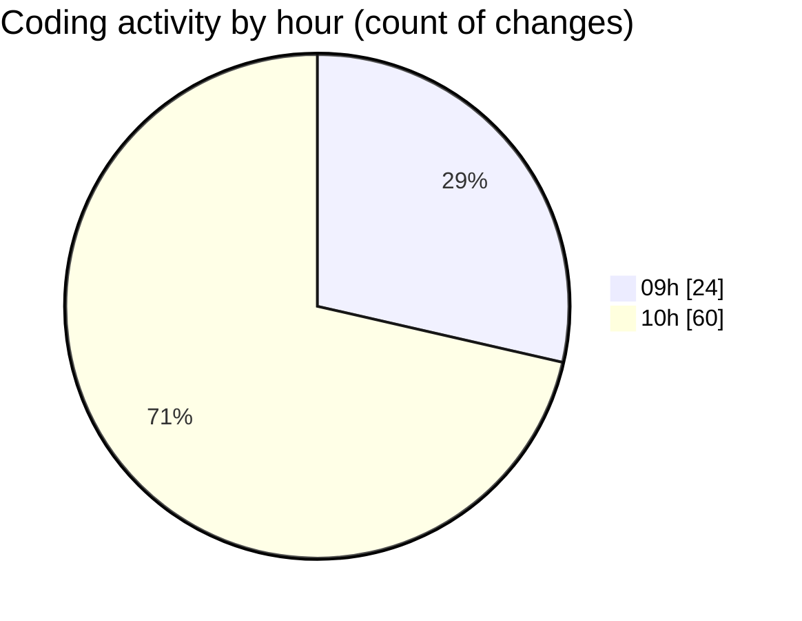

# cda - Activity Summary 

## Overall Statistics

| Stat                   | Value                                                             |
| ---------------------- | ----------------------------------------------------------------- |
| **Lines Added** (➕)   | 388                                          |
| **Lines Removed** (➖) | 193                                        |
| **Net Change** (↕)    | 195                |
| **Active Time** (⌚)   | 128 minutes |

## Modified Files
- **MediaUploader.tsx** (+6, -11)
- **processImage.ts** (+40, -28)
- **MediaUploade.test.tsx** (+52, -35)
- **EventPage.scss** (+0, -5)
- **config.ts** (+23, -0)
- **processImage.test.ts** (+267, -114)

## Visualizations

### By File Type (Lines Changed)

### By Hour (Estimated Activity Count)

> **Last Updated:** 07/10/2025, 11:02:42