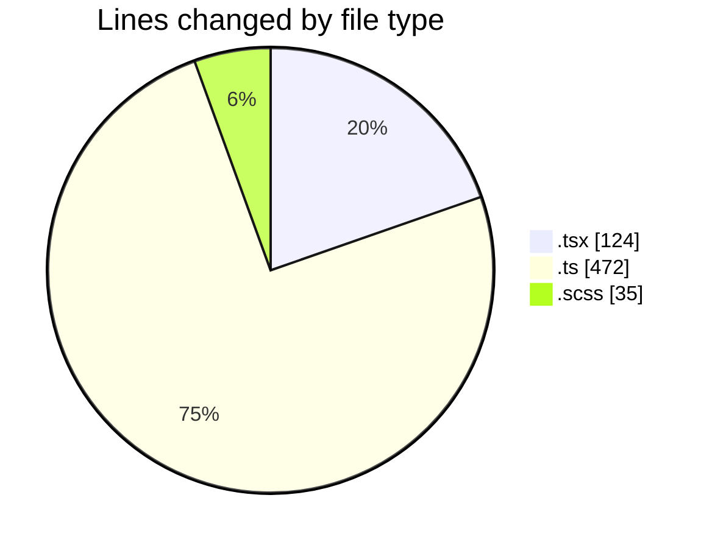
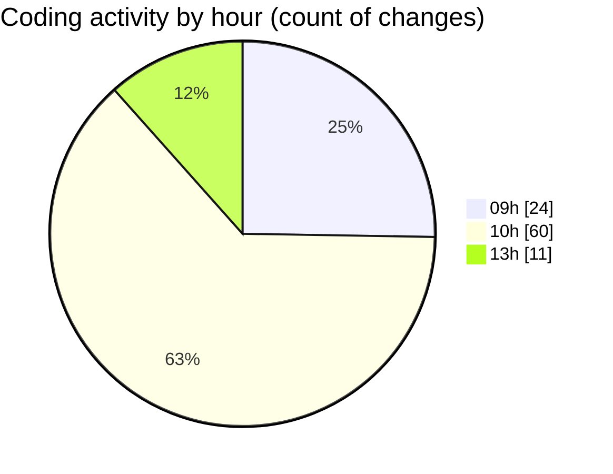

# cda - Activity Summary 

## Overall Statistics

| Stat                   | Value                                                             |
| ---------------------- | ----------------------------------------------------------------- |
| **Lines Added** (➕)   | 399                                          |
| **Lines Removed** (➖) | 232                                        |
| **Net Change** (↕)    | 167                |
| **Active Time** (⌚)   | 151 minutes |

## Modified Files
- **MediaUploader.tsx** (+8, -18)
- **processImage.ts** (+40, -28)
- **MediaUploade.test.tsx** (+53, -35)
- **EventPage.scss** (+8, -6)
- **config.ts** (+23, -0)
- **processImage.test.ts** (+267, -114)
- **EventPage.tsx** (+0, -10)
- **MediaUploader.scss** (+0, -21)

## Visualizations

### By File Type (Lines Changed)

### By Hour (Estimated Activity Count)

> **Last Updated:** 07/10/2025, 13:27:42