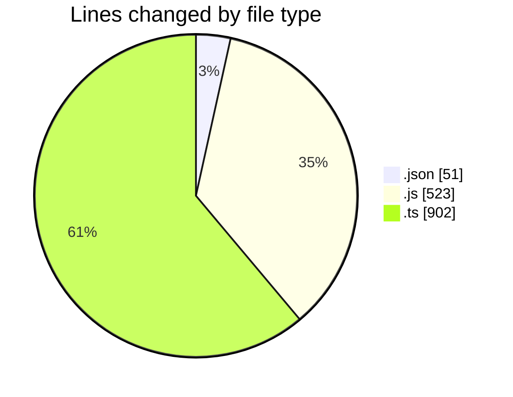
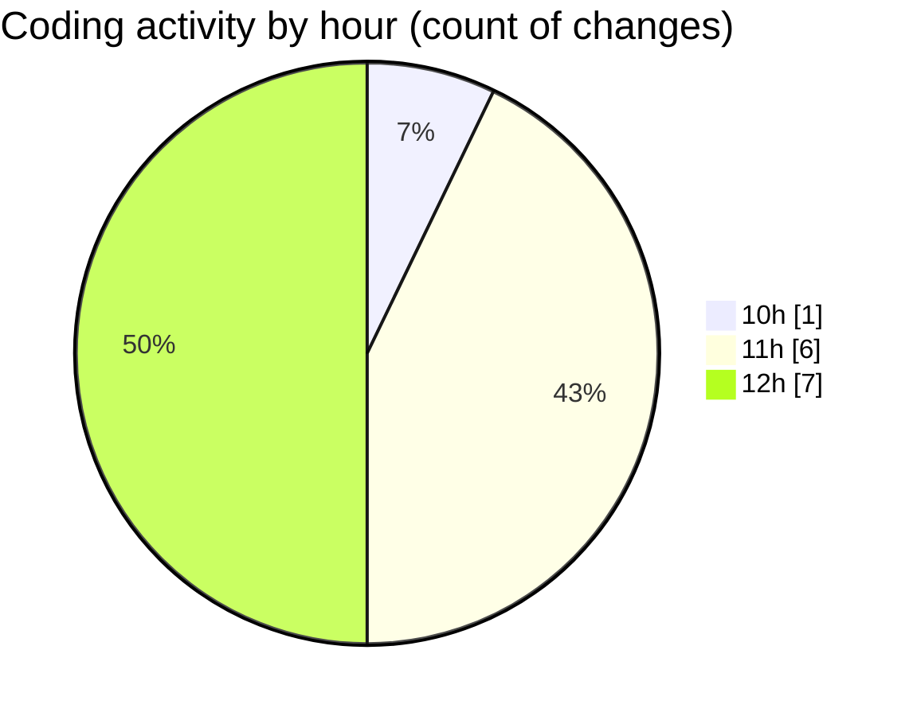

# cda - Activity Summary 

## Overall Statistics

| Stat                   | Value                                                             |
| ---------------------- | ----------------------------------------------------------------- |
| **Lines Added** (➕)   | 1464                                          |
| **Lines Removed** (➖) | 12                                        |
| **Net Change** (↕)    | 1452                |
| **Active Time** (⌚)   | 4 minutes |

## Modified Files
- **settings.json** (+51, -0)
- **App.js** (+206, -12)
- **mutations.js** (+3, -0)
- **skill-mutations.ts** (+584, -0)
- **skill-assign-mutations.ts** (+318, -0)
- **skills.js** (+302, -0)

## Visualizations

### By File Type (Lines Changed)

### By Hour (Estimated Activity Count)

> **Last Updated:** 08/10/2025, 12:24:03