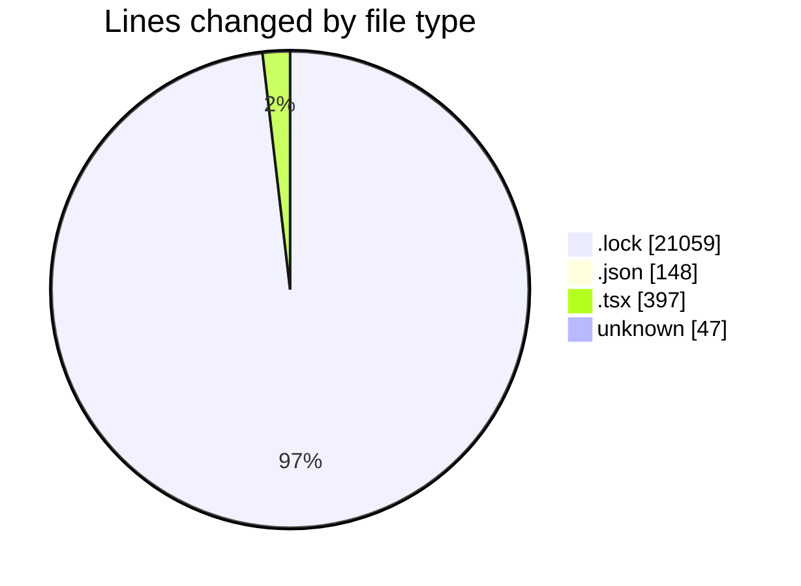
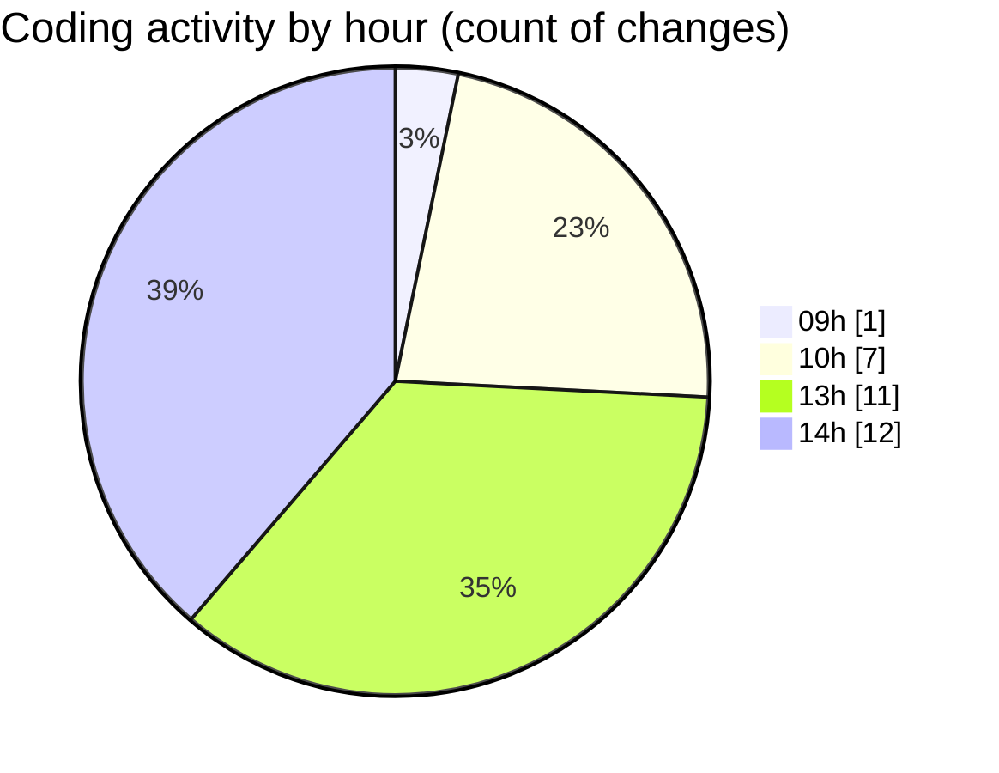

# cda - Activity Summary 

## Overall Statistics

| Stat                   | Value                                                             |
| ---------------------- | ----------------------------------------------------------------- |
| **Lines Added** (➕)   | 21617                                          |
| **Lines Removed** (➖) | 34                                        |
| **Net Change** (↕)    | 21583                |
| **Active Time** (⌚)   | 51 minutes |

## Modified Files
- **yarn.lock** (+17734, -0)
- **settings.json** (+55, -0)
- **package.json** (+66, -0)
- **package.json** (+26, -1)
- **yarn.lock** (+3325, -0)
- **Register.tsx** (+151, -33)
- **EventCard.tsx** (+213, -0)
- **.env** (+47, -0)

## Visualizations

### By File Type (Lines Changed)

### By Hour (Estimated Activity Count)

> **Last Updated:** 20/10/2025, 14:22:47