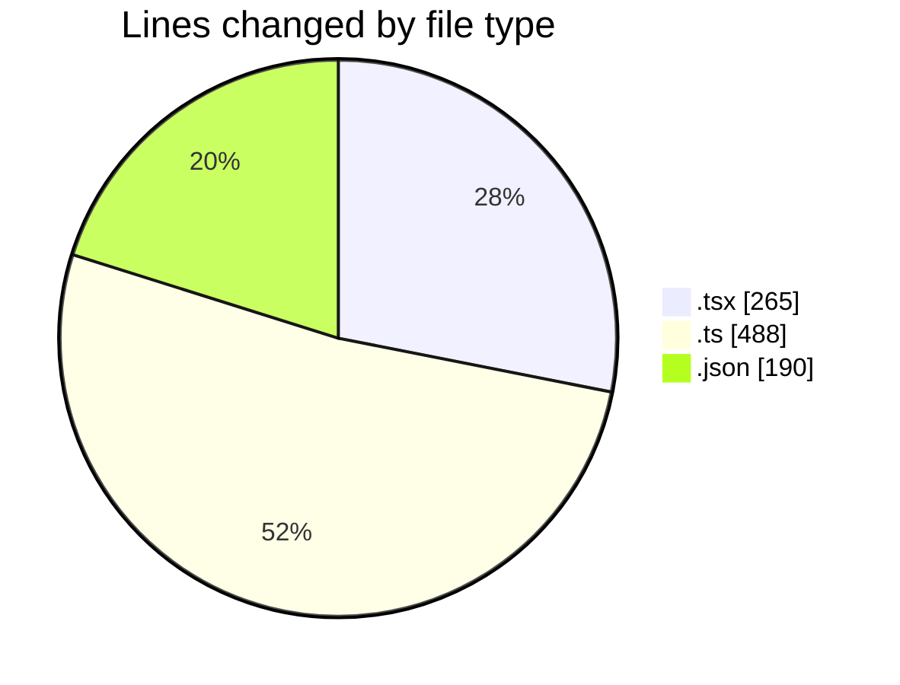
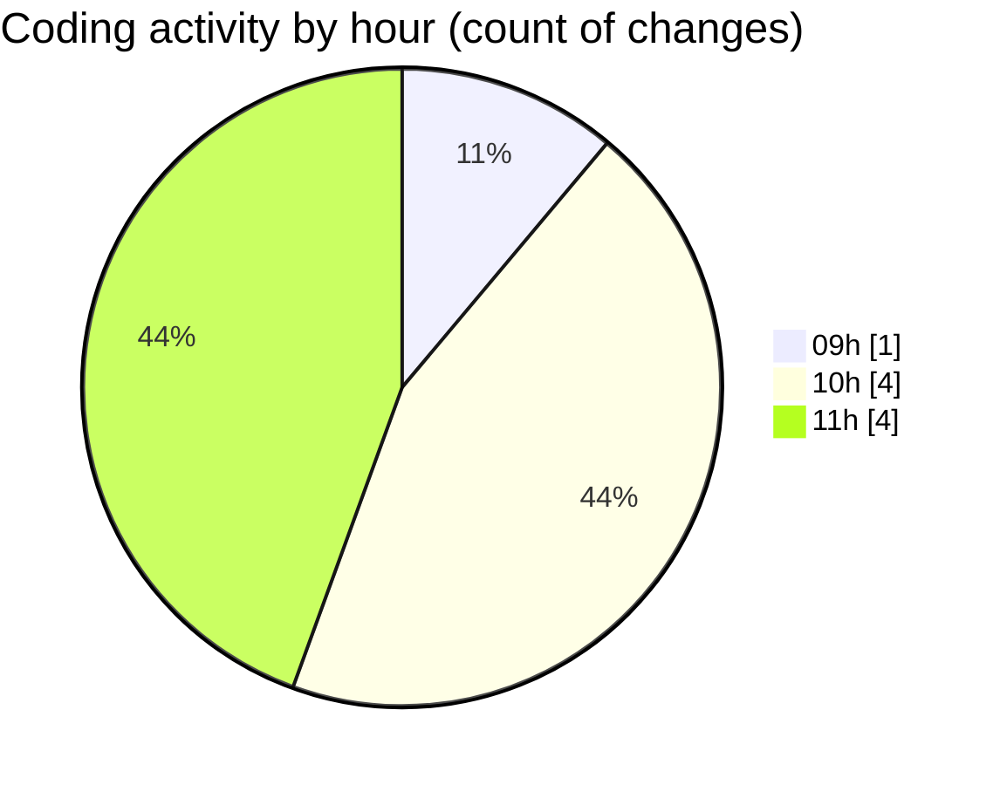

# cda - Activity Summary 

## Overall Statistics

| Stat                   | Value                                                             |
| ---------------------- | ----------------------------------------------------------------- |
| **Lines Added** (➕)   | 929                                          |
| **Lines Removed** (➖) | 14                                        |
| **Net Change** (↕)    | 915                |
| **Active Time** (⌚)   | 6 minutes |

## Modified Files
- **Register.tsx** (+0, -3)
- **App.tsx** (+251, -11)
- **getAllocateDuties.ts** (+415, -0)
- **DBService.ts** (+73, -0)
- **lambda.json** (+190, -0)

## Visualizations

### By File Type (Lines Changed)

### By Hour (Estimated Activity Count)

> **Last Updated:** 21/10/2025, 11:57:04