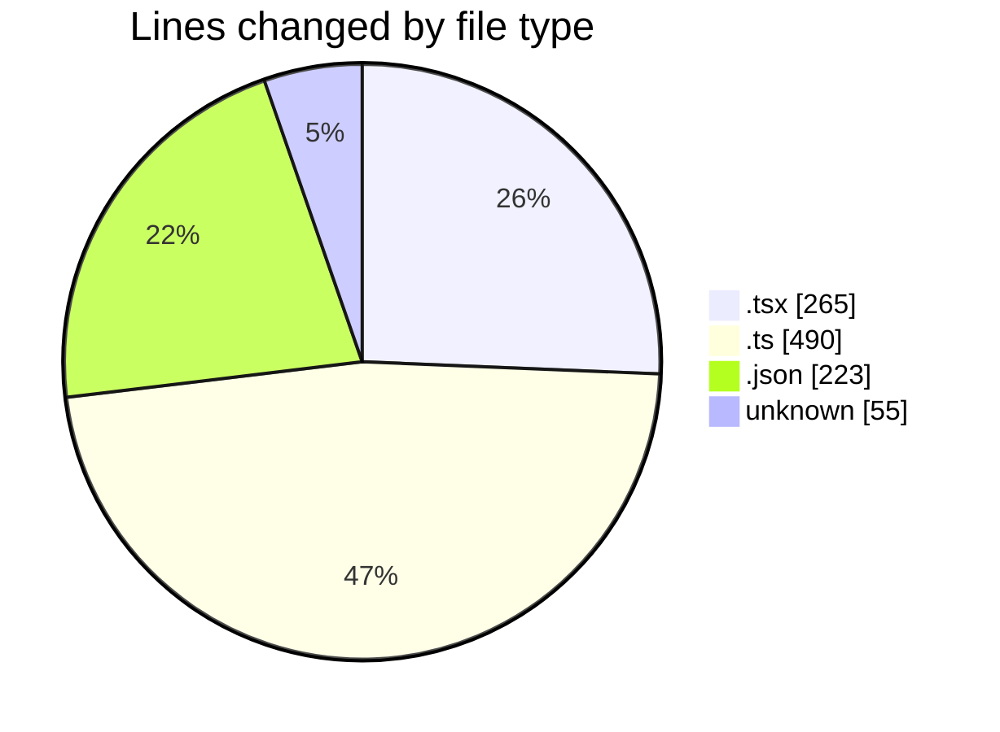
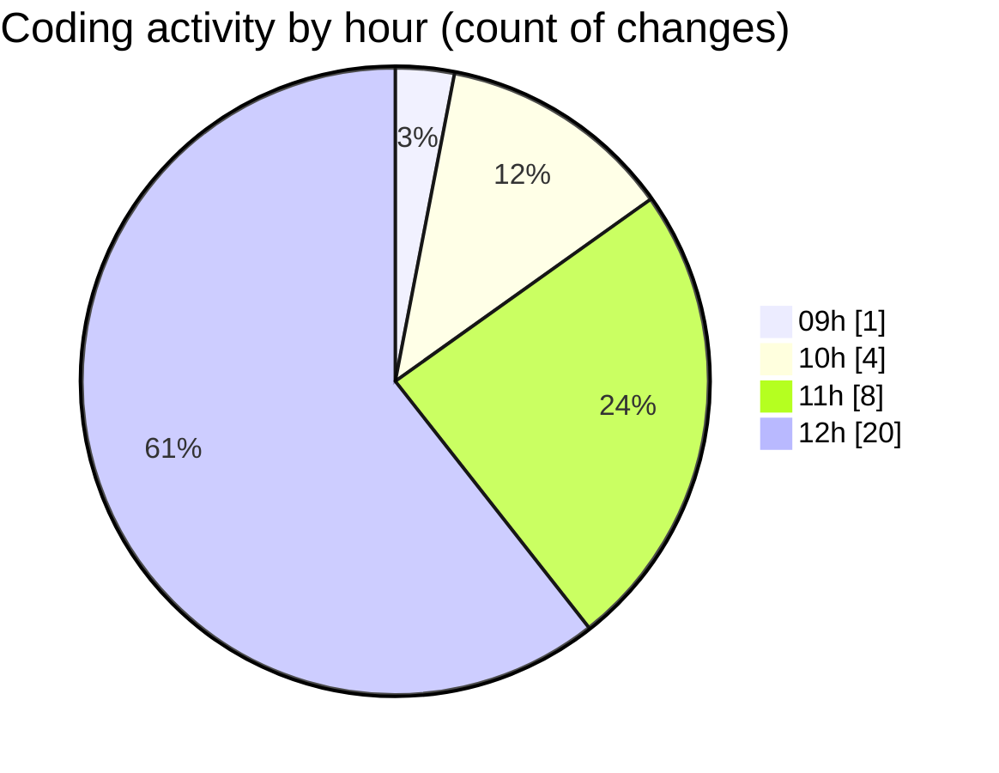

# cda - Activity Summary 

## Overall Statistics

| Stat                   | Value                                                             |
| ---------------------- | ----------------------------------------------------------------- |
| **Lines Added** (➕)   | 1009                                          |
| **Lines Removed** (➖) | 24                                        |
| **Net Change** (↕)    | 985                |
| **Active Time** (⌚)   | 30 minutes |

## Modified Files
- **Register.tsx** (+0, -3)
- **App.tsx** (+251, -11)
- **getAllocateDuties.ts** (+415, -0)
- **DBService.ts** (+73, -0)
- **lambda.json** (+190, -0)
- **global.d.ts** (+2, -0)
- **tsconfig.json** (+27, -6)
- **.gitignore** (+51, -4)

## Visualizations

### By File Type (Lines Changed)

### By Hour (Estimated Activity Count)

> **Last Updated:** 21/10/2025, 12:07:04