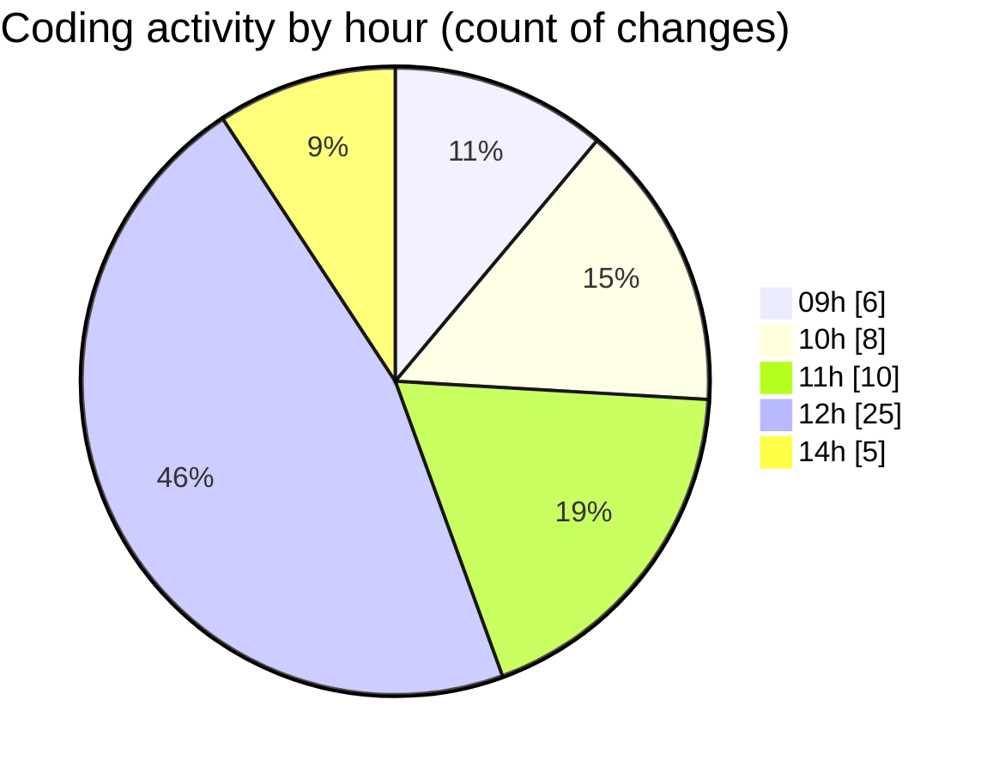

# cda - Activity Summary 

## Overall Statistics

| Stat                   | Value                                                             |
| ---------------------- | ----------------------------------------------------------------- |
| **Lines Added** (➕)   | 2084                                          |
| **Lines Removed** (➖) | 68                                        |
| **Net Change** (↕)    | 2016                |
| **Active Time** (⌚)   | 64 minutes |

## Modified Files
- **NotificationService.ts** (+1071, -0)
- **settings.json** (+112, -2)
- **lambda.json** (+392, -0)
- **emails.ts** (+264, -60)
- **iCalendar.ts** (+75, -1)
- **package.json** (+67, -0)
- **tsconfig.json** (+22, -1)
- **calendar.json** (+16, -0)
- **index.tsx** (+65, -4)

## Visualizations

### By File Type (Lines Changed)

### By Hour (Estimated Activity Count)

> **Last Updated:** 22/10/2025, 14:22:29