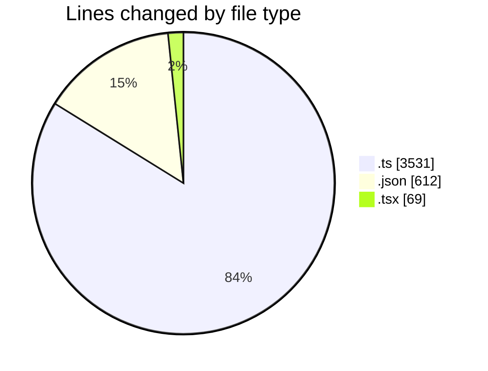
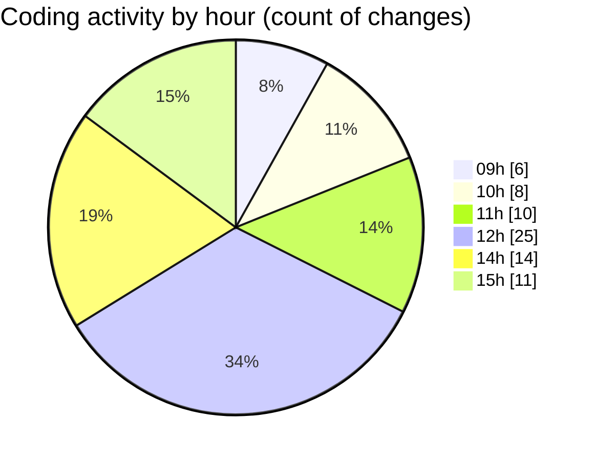

# cda - Activity Summary 

## Overall Statistics

| Stat                   | Value                                                             |
| ---------------------- | ----------------------------------------------------------------- |
| **Lines Added** (➕)   | 4125                                          |
| **Lines Removed** (➖) | 87                                        |
| **Net Change** (↕)    | 4038                |
| **Active Time** (⌚)   | 98 minutes |

## Modified Files
- **NotificationService.ts** (+2142, -0)
- **settings.json** (+112, -2)
- **lambda.json** (+392, -0)
- **emails.ts** (+276, -70)
- **iCalendar.ts** (+83, -10)
- **package.json** (+67, -0)
- **tsconfig.json** (+22, -1)
- **calendar.json** (+16, -0)
- **index.tsx** (+65, -4)
- **calendar.ts** (+950, -0)

## Visualizations

### By File Type (Lines Changed)

### By Hour (Estimated Activity Count)

> **Last Updated:** 22/10/2025, 15:37:29