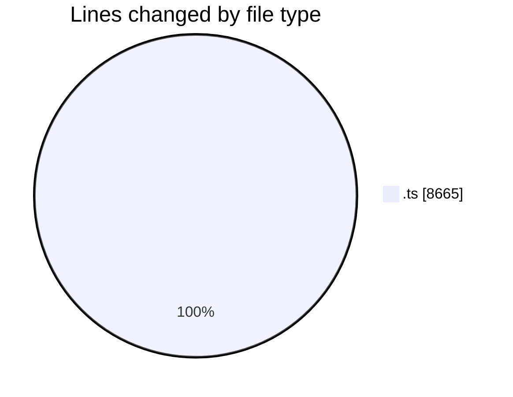
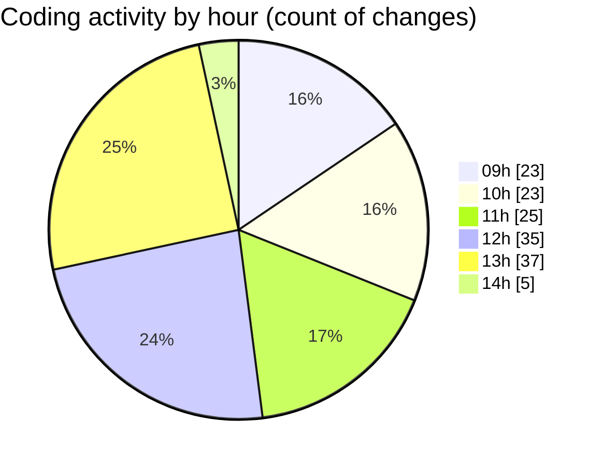

# cda - Activity Summary 

## Overall Statistics

| Stat                   | Value                                                             |
| ---------------------- | ----------------------------------------------------------------- |
| **Lines Added** (➕)   | 7574                                          |
| **Lines Removed** (➖) | 1091                                        |
| **Net Change** (↕)    | 6483                |
| **Active Time** (⌚)   | 240 minutes |

## Modified Files
- **iCalendar.ts** (+91, -16)
- **emails.test.ts** (+1013, -301)
- **emails.ts** (+230, -12)
- **calendar.ts** (+950, -0)
- **NotificationService.ts** (+1071, -0)
- **calendar-mutations.ts** (+3214, -0)
- **iCalendar.test.ts** (+1005, -762)

## Visualizations

### By File Type (Lines Changed)

### By Hour (Estimated Activity Count)

> **Last Updated:** 23/10/2025, 14:02:41