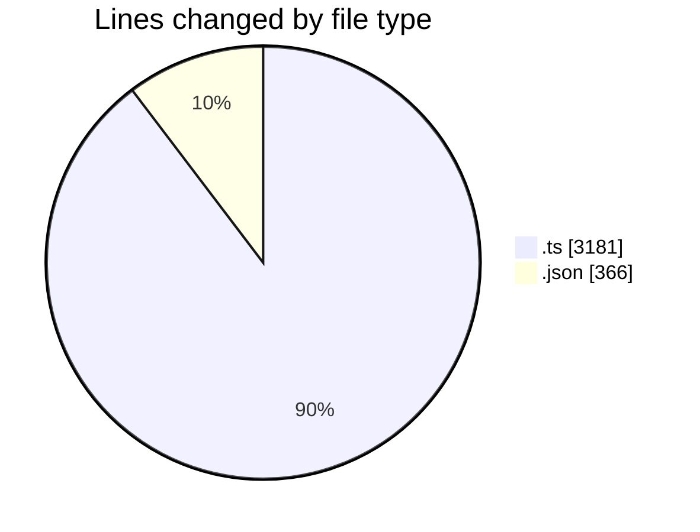
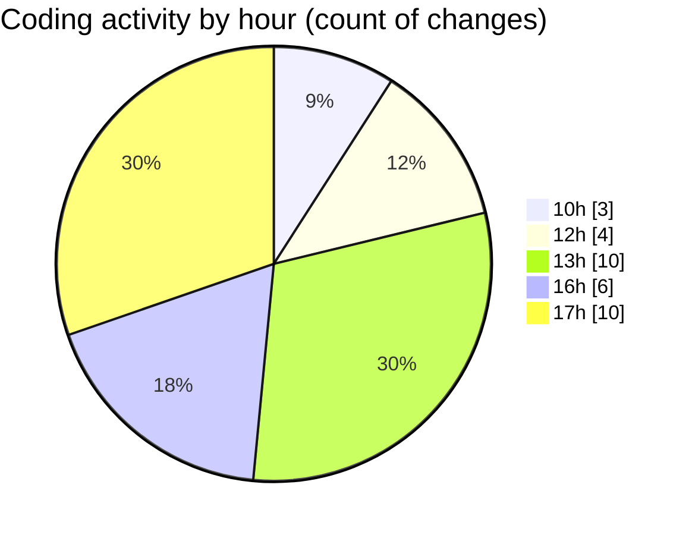

# cda - Activity Summary 

## Overall Statistics

| Stat                   | Value                                                             |
| ---------------------- | ----------------------------------------------------------------- |
| **Lines Added** (➕)   | 3501                                          |
| **Lines Removed** (➖) | 46                                        |
| **Net Change** (↕)    | 3455                |
| **Active Time** (⌚)   | 35 minutes |

## Modified Files
- **iCalendar.ts** (+178, -9)
- **iCalendar.test.ts** (+247, -9)
- **lambda.json** (+217, -0)
- **lambda-policy.json** (+127, -22)
- **emails.ts** (+219, -0)
- **calendar.ts** (+959, -5)
- **emails.test.ts** (+1554, -1)

## Visualizations

### By File Type (Lines Changed)

### By Hour (Estimated Activity Count)

> **Last Updated:** 27/10/2025, 17:27:15