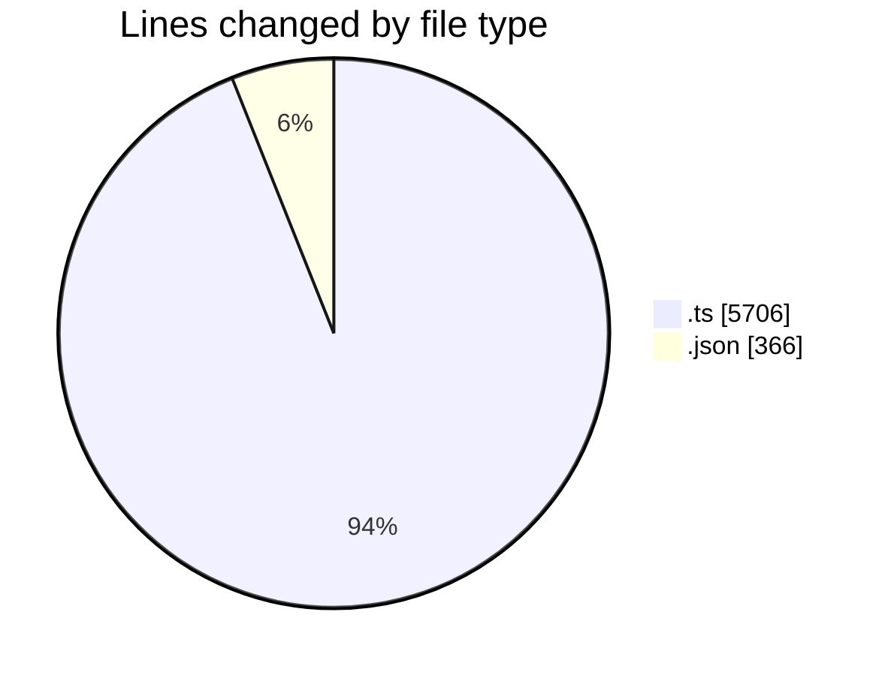
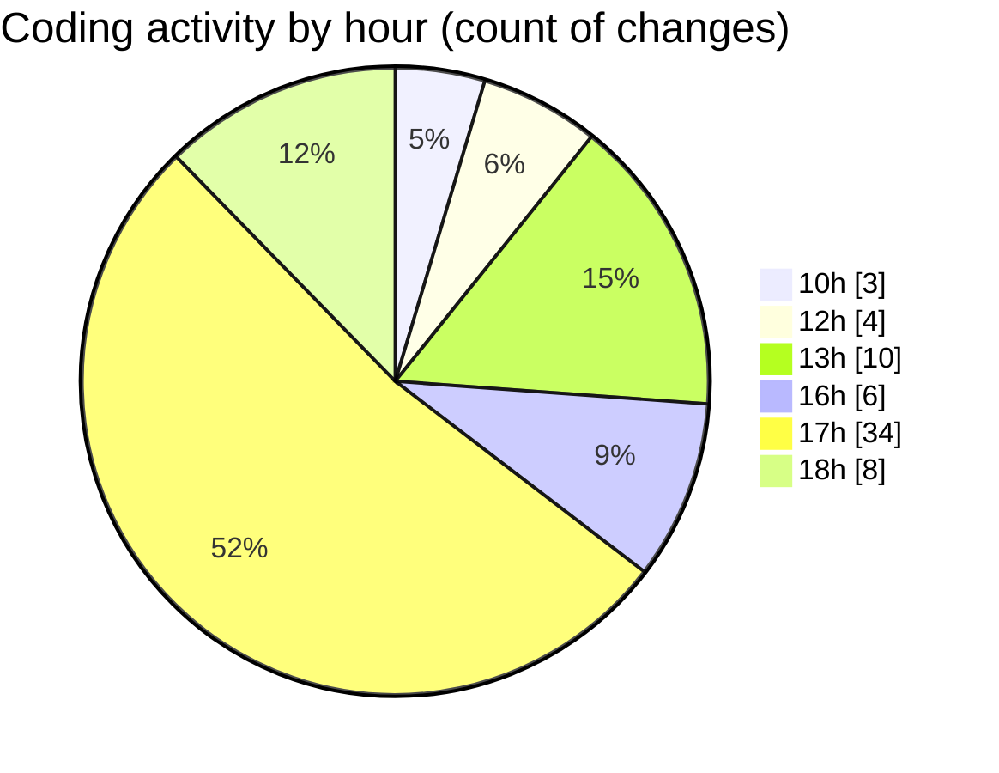

# cda - Activity Summary 

## Overall Statistics

| Stat                   | Value                                                             |
| ---------------------- | ----------------------------------------------------------------- |
| **Lines Added** (➕)   | 5988                                          |
| **Lines Removed** (➖) | 84                                        |
| **Net Change** (↕)    | 5904                |
| **Active Time** (⌚)   | 72 minutes |

## Modified Files
- **iCalendar.ts** (+288, -26)
- **iCalendar.test.ts** (+255, -17)
- **lambda.json** (+217, -0)
- **lambda-policy.json** (+127, -22)
- **emails.ts** (+667, -6)
- **calendar.ts** (+2879, -11)
- **emails.test.ts** (+1555, -2)

## Visualizations

### By File Type (Lines Changed)

### By Hour (Estimated Activity Count)

> **Last Updated:** 27/10/2025, 18:07:45