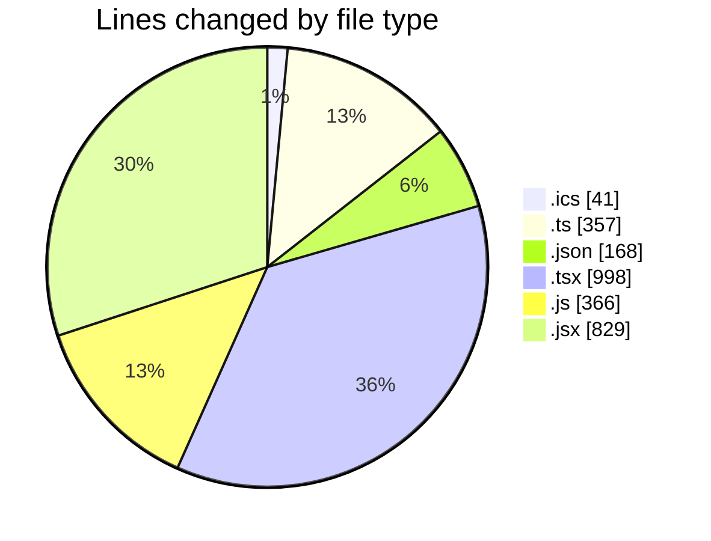
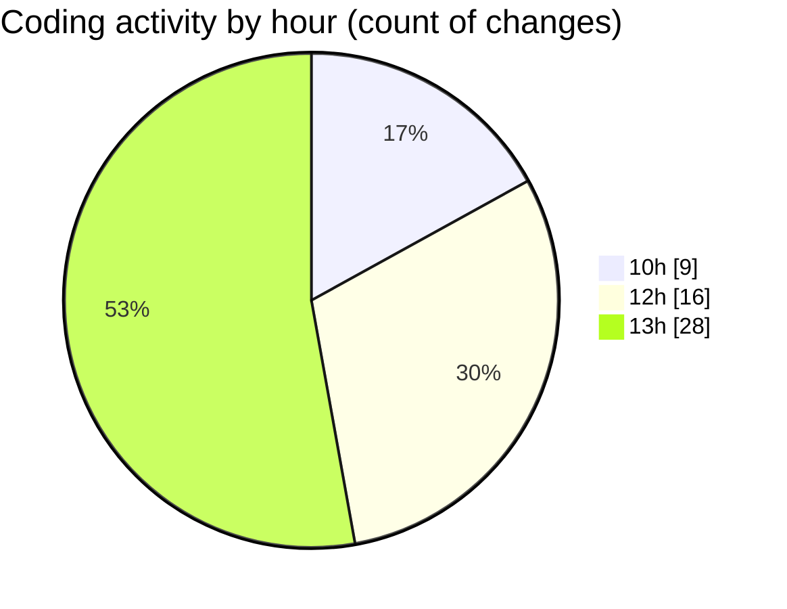

# cda - Activity Summary 

## Overall Statistics

| Stat                   | Value                                                             |
| ---------------------- | ----------------------------------------------------------------- |
| **Lines Added** (➕)   | 2688                                          |
| **Lines Removed** (➖) | 71                                        |
| **Net Change** (↕)    | 2617                |
| **Active Time** (⌚)   | 67 minutes |

## Modified Files
- **1-Sep 10th Event (Copy).ics** (+20, -0)
- **2-Sep 10th Event - Update L…-update.ics** (+21, -0)
- **iCalendar.ts** (+101, -4)
- **settings.json** (+56, -0)
- **emails.ts** (+223, -27)
- **App.tsx** (+244, -4)
- **index.js** (+58, -4)
- **App.js** (+198, -9)
- **global.d.ts** (+2, -0)
- **tsconfig.json** (+21, -0)
- **Record.tsx** (+226, -0)
- **PreferenceSkillTags.tsx** (+226, -2)
- **SkillTagCreateOptions.tsx** (+125, -0)
- **MyBuildingPanel.jsx** (+149, -0)
- **index.js** (+97, -0)
- **DevelopPanel.tsx** (+152, -19)
- **package.json** (+90, -1)
- **MyProfile.jsx** (+679, -1)

## Visualizations

### By File Type (Lines Changed)

### By Hour (Estimated Activity Count)

> **Last Updated:** 28/10/2025, 13:58:45