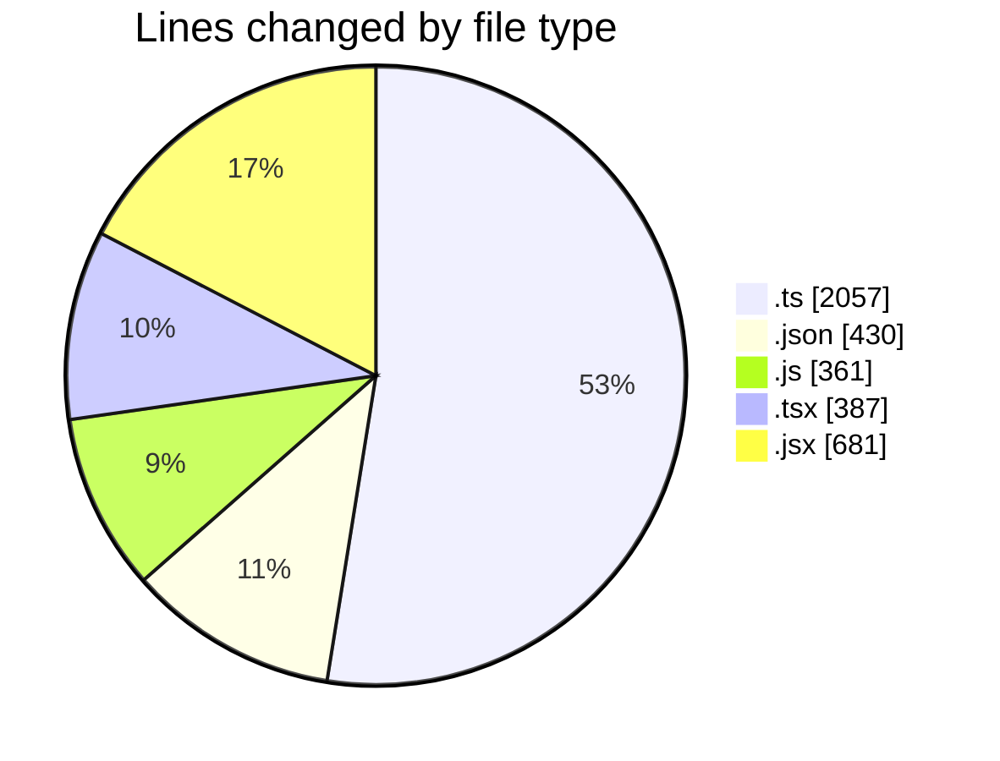

# cda - Activity Summary 

## Overall Statistics

| Stat                   | Value                                                             |
| ---------------------- | ----------------------------------------------------------------- |
| **Lines Added** (➕)   | 3843                                          |
| **Lines Removed** (➖) | 73                                        |
| **Net Change** (↕)    | 3770                |
| **Active Time** (⌚)   | 72 minutes |

## Modified Files
- **emails.ts** (+250, -27)
- **lambda-policy.json** (+105, -0)
- **infrastructure.json** (+176, -0)
- **calendar.ts** (+985, -18)
- **emails.test.ts** (+777, -0)
- **index.js** (+54, -0)
- **App.js** (+199, -5)
- **PreferenceSkillTags.tsx** (+226, -4)
- **DevelopPanel.tsx** (+145, -12)
- **package.json** (+91, -1)
- **MyProfile.jsx** (+680, -1)
- **package.json** (+57, -0)
- **20251029101734-alter-calendar-event-table.js** (+17, -5)
- **20251029103947-alter-calendar-event-view.js** (+81, -0)

## Visualizations

### By File Type (Lines Changed)

### By Hour (Estimated Activity Count)

> **Last Updated:** 29/10/2025, 10:59:47