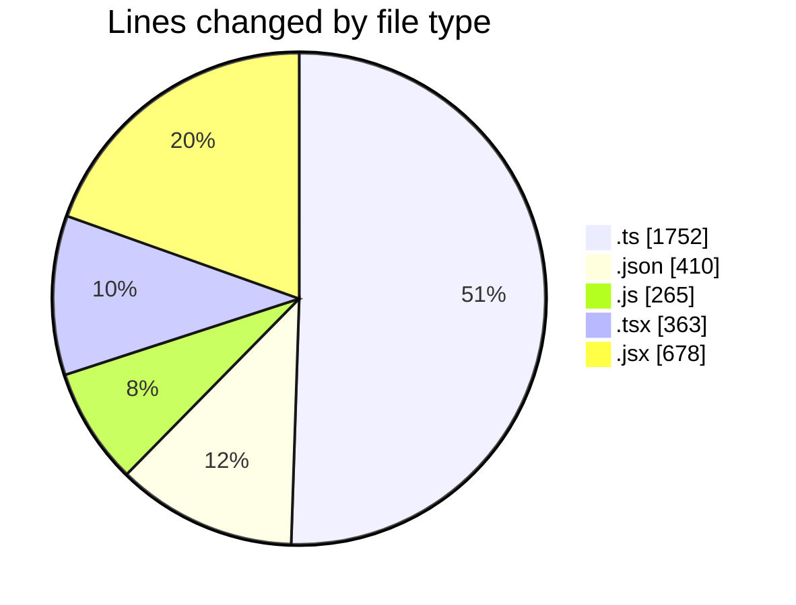
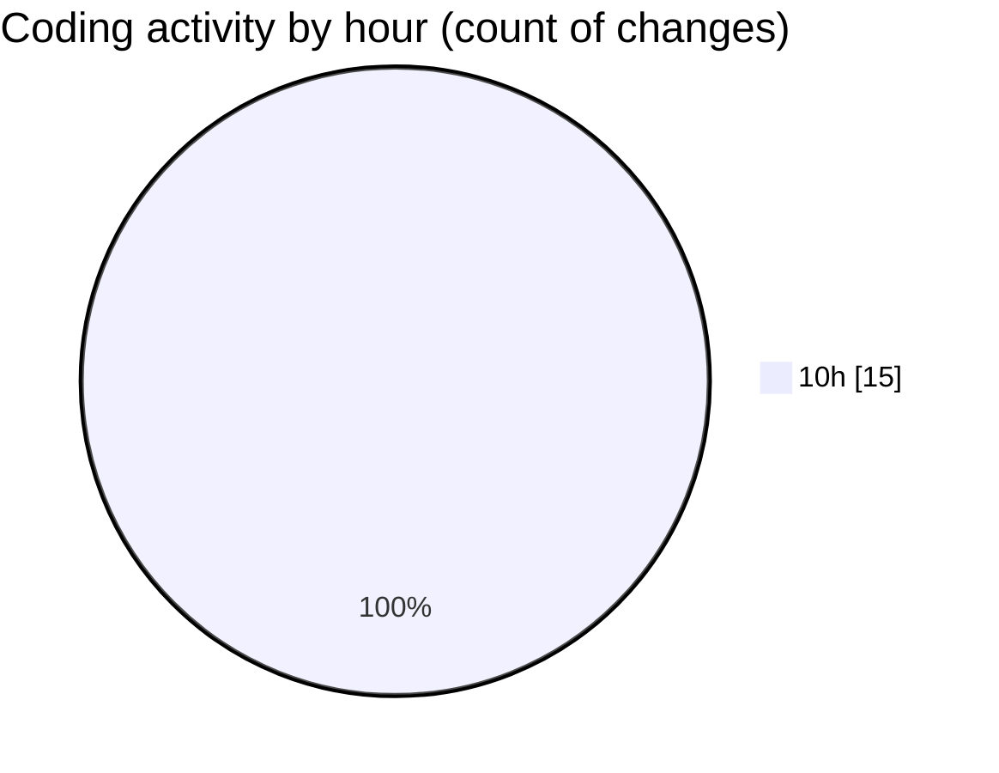

# cda - Activity Summary 

## Overall Statistics

| Stat                   | Value                                                             |
| ---------------------- | ----------------------------------------------------------------- |
| **Lines Added** (➕)   | 3463                                          |
| **Lines Removed** (➖) | 5                                        |
| **Net Change** (↕)    | 3458                |
| **Active Time** (⌚)   | 18 minutes |

## Modified Files
- **emails.ts** (+196, -0)
- **lambda-policy.json** (+89, -0)
- **infrastructure.json** (+175, -0)
- **calendar.ts** (+942, -0)
- **emails.test.ts** (+614, -0)
- **index.js** (+54, -0)
- **App.js** (+189, -0)
- **PreferenceSkillTags.tsx** (+224, -0)
- **DevelopPanel.tsx** (+139, -0)
- **package.json** (+89, -0)
- **MyProfile.jsx** (+678, -0)
- **package.json** (+57, -0)
- **20251029101734-alter-calendar-event-table.js** (+17, -5)

## Visualizations

### By File Type (Lines Changed)

### By Hour (Estimated Activity Count)

> **Last Updated:** 29/10/2025, 10:24:47