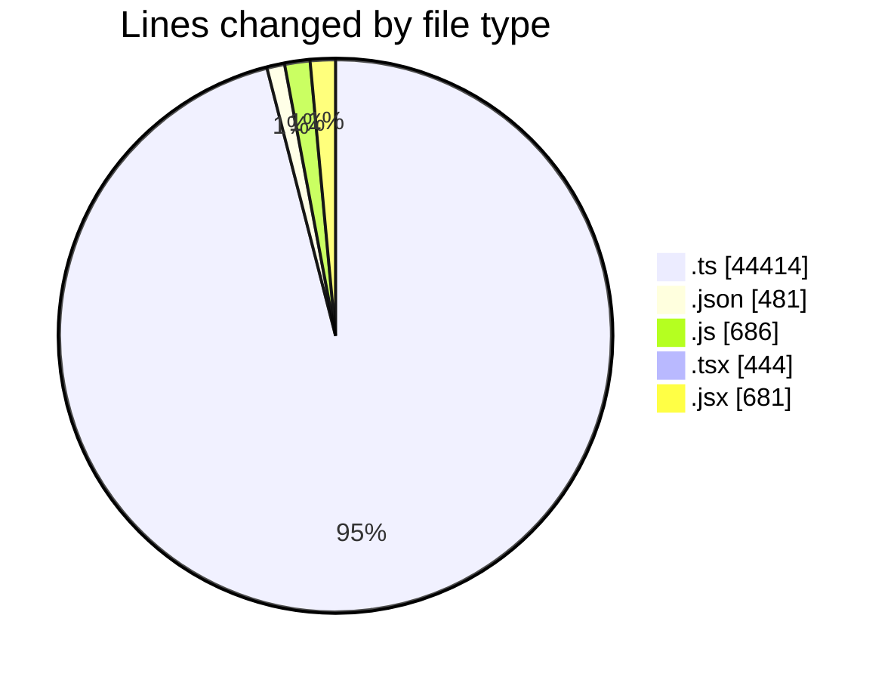
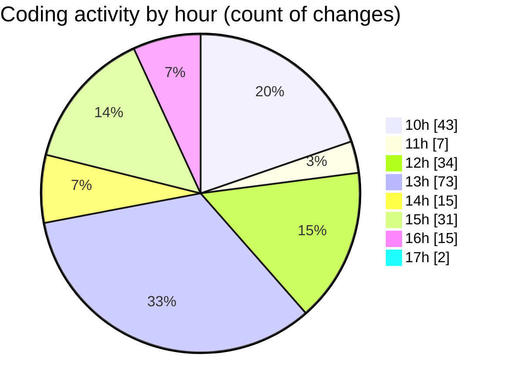

# cda - Activity Summary 

## Overall Statistics

| Stat                   | Value                                                             |
| ---------------------- | ----------------------------------------------------------------- |
| **Lines Added** (➕)   | 45761                                          |
| **Lines Removed** (➖) | 945                                        |
| **Net Change** (↕)    | 44816                |
| **Active Time** (⌚)   | 351 minutes |

## Modified Files
- **emails.ts** (+278, -55)
- **lambda-policy.json** (+121, -32)
- **infrastructure.json** (+177, -2)
- **calendar.ts** (+1144, -167)
- **emails.test.ts** (+1143, -366)
- **index.js** (+54, -0)
- **App.js** (+199, -5)
- **PreferenceSkillTags.tsx** (+226, -4)
- **DevelopPanel.tsx** (+145, -12)
- **package.json** (+91, -1)
- **MyProfile.jsx** (+680, -1)
- **package.json** (+57, -0)
- **20251029101734-alter-calendar-event-table.js** (+17, -5)
- **20251029103947-alter-calendar-event-view.js** (+81, -0)
- **iCalendar.ts** (+206, -108)
- **tables.ts** (+5952, -8)
- **views.ts** (+8753, -26)
- **calendar.js** (+323, -2)
- **resolvers-types.ts** (+9857, -4)
- **iCalendar.test.ts** (+187, -64)
- **calendar-mutations.ts** (+3321, -83)
- **clear_view_views.ts** (+3625, -0)
- **index.tsx** (+57, -0)
- **activityFeed.test.ts** (+111, -0)
- **views.ts** (+8727, -0)
- **events.ts** (+229, -0)

## Visualizations

### By File Type (Lines Changed)

### By Hour (Estimated Activity Count)

> **Last Updated:** 29/10/2025, 17:05:22