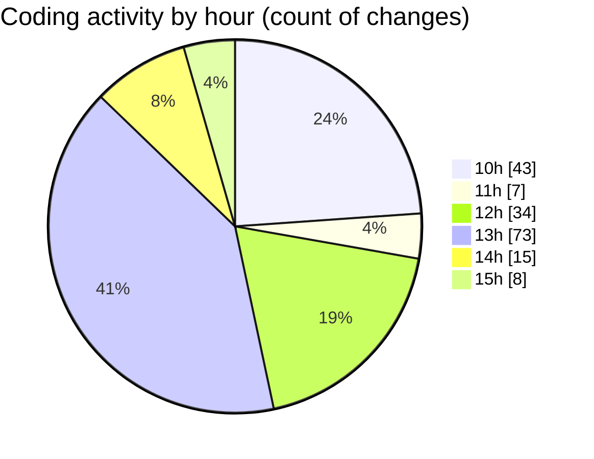

# cda - Activity Summary 

## Overall Statistics

| Stat                   | Value                                                             |
| ---------------------- | ----------------------------------------------------------------- |
| **Lines Added** (➕)   | 32877                                          |
| **Lines Removed** (➖) | 674                                        |
| **Net Change** (↕)    | 32203                |
| **Active Time** (⌚)   | 278 minutes |

## Modified Files
- **emails.ts** (+274, -51)
- **lambda-policy.json** (+121, -32)
- **infrastructure.json** (+177, -2)
- **calendar.ts** (+1121, -144)
- **emails.test.ts** (+1105, -172)
- **index.js** (+54, -0)
- **App.js** (+199, -5)
- **PreferenceSkillTags.tsx** (+226, -4)
- **DevelopPanel.tsx** (+145, -12)
- **package.json** (+91, -1)
- **MyProfile.jsx** (+680, -1)
- **package.json** (+57, -0)
- **20251029101734-alter-calendar-event-table.js** (+17, -5)
- **20251029103947-alter-calendar-event-view.js** (+81, -0)
- **iCalendar.ts** (+194, -94)
- **tables.ts** (+5952, -8)
- **views.ts** (+8740, -26)
- **calendar.js** (+323, -2)
- **resolvers-types.ts** (+9857, -4)
- **iCalendar.test.ts** (+187, -64)
- **calendar-mutations.ts** (+3276, -47)

## Visualizations

### By File Type (Lines Changed)

### By Hour (Estimated Activity Count)

> **Last Updated:** 29/10/2025, 15:34:47