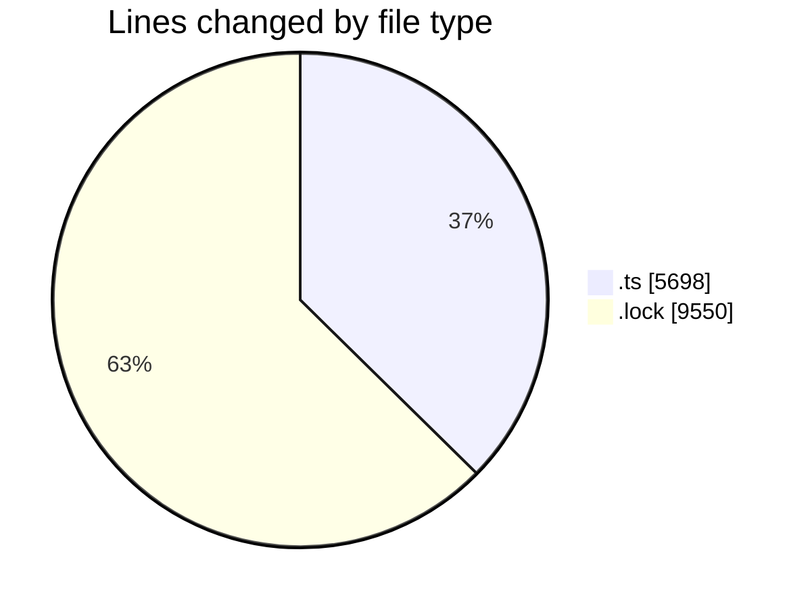
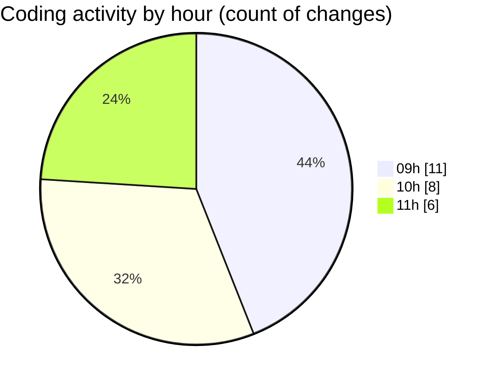

# cda - Activity Summary 

## Overall Statistics

| Stat                   | Value                                                             |
| ---------------------- | ----------------------------------------------------------------- |
| **Lines Added** (➕)   | 15229                                          |
| **Lines Removed** (➖) | 19                                        |
| **Net Change** (↕)    | 15210                |
| **Active Time** (⌚)   | 36 minutes |

## Modified Files
- **calendar.ts** (+1980, -8)
- **iCalendar.ts** (+204, -4)
- **iCalendar.test.ts** (+257, -7)
- **calendar-mutations.ts** (+3238, -0)
- **yarn.lock** (+9550, -0)

## Visualizations

### By File Type (Lines Changed)

### By Hour (Estimated Activity Count)

> **Last Updated:** 30/10/2025, 11:24:28