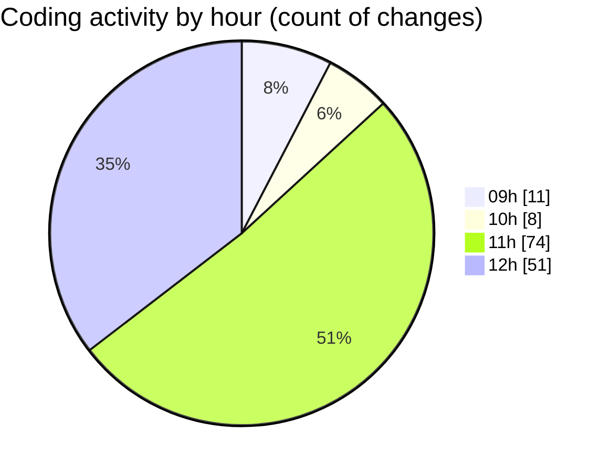

# cda - Activity Summary 

## Overall Statistics

| Stat                   | Value                                                             |
| ---------------------- | ----------------------------------------------------------------- |
| **Lines Added** (➕)   | 18910                                          |
| **Lines Removed** (➖) | 2590                                        |
| **Net Change** (↕)    | 16320                |
| **Active Time** (⌚)   | 193 minutes |

## Modified Files
- **calendar.ts** (+3214, -1242)
- **iCalendar.ts** (+624, -436)
- **iCalendar.test.ts** (+399, -124)
- **calendar-mutations.ts** (+3262, -48)
- **yarn.lock** (+9550, -0)
- **emails.ts** (+879, -656)
- **emails.test.ts** (+836, -59)
- **lambda-policy.json** (+130, -25)
- **calendar.json** (+16, -0)

## Visualizations

### By File Type (Lines Changed)

### By Hour (Estimated Activity Count)

> **Last Updated:** 30/10/2025, 12:44:28