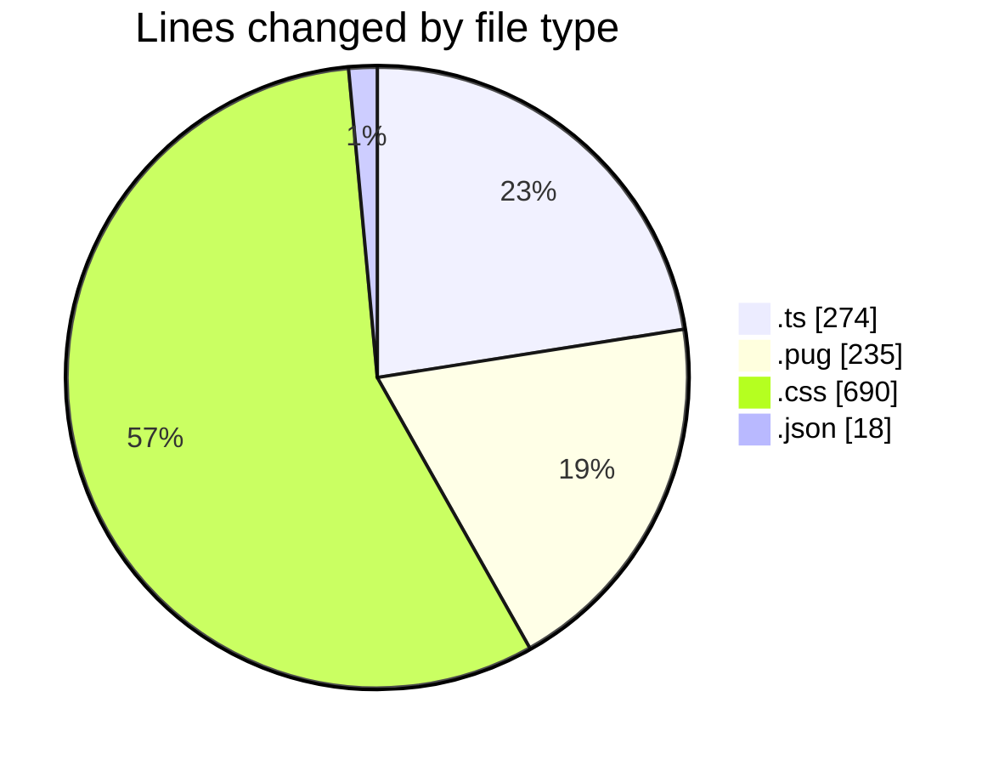
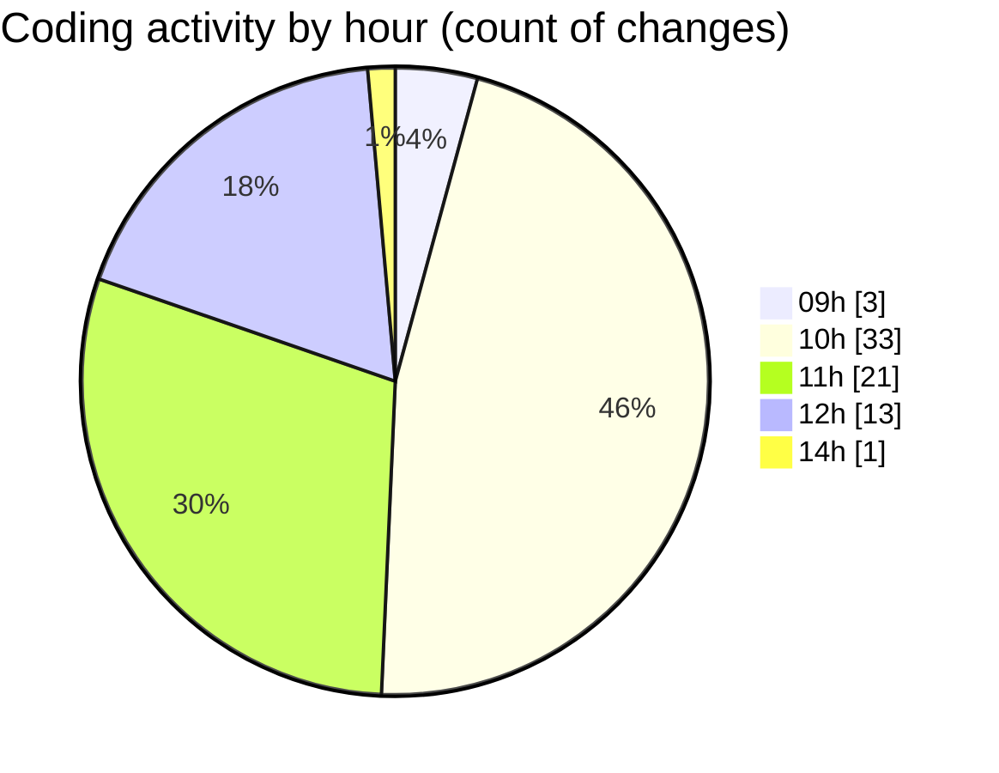

# cda - Activity Summary 

## Overall Statistics

| Stat                   | Value                                                             |
| ---------------------- | ----------------------------------------------------------------- |
| **Lines Added** (➕)   | 1085                                          |
| **Lines Removed** (➖) | 132                                        |
| **Net Change** (↕)    | 953                |
| **Active Time** (⌚)   | 109 minutes |

## Modified Files
- **calendar-mutations.ts** (+0, -38)
- **calendar.ts** (+0, -17)
- **html.pug** (+115, -35)
- **html.pug** (+79, -6)
- **style.css** (+370, -35)
- **calendar.json** (+18, -0)
- **style.css** (+284, -1)
- **emails.ts** (+219, -0)

## Visualizations

### By File Type (Lines Changed)

### By Hour (Estimated Activity Count)

> **Last Updated:** 31/10/2025, 14:40:46