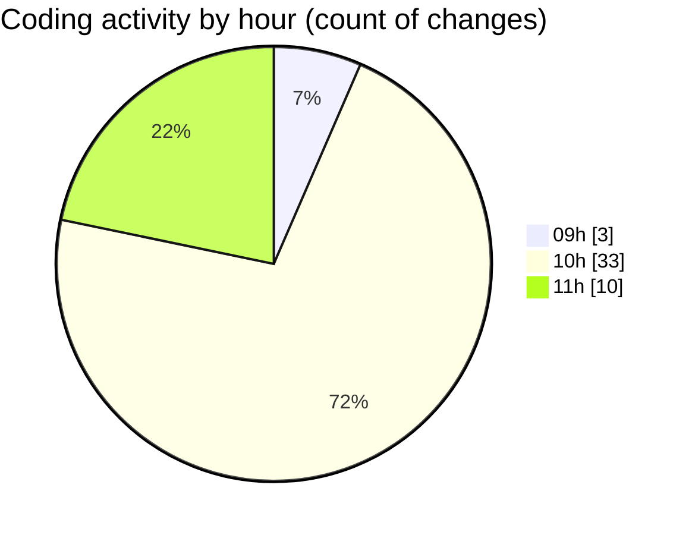

# cda - Activity Summary 

## Overall Statistics

| Stat                   | Value                                                             |
| ---------------------- | ----------------------------------------------------------------- |
| **Lines Added** (➕)   | 572                                          |
| **Lines Removed** (➖) | 108                                        |
| **Net Change** (↕)    | 464                |
| **Active Time** (⌚)   | 64 minutes |

## Modified Files
- **calendar-mutations.ts** (+0, -38)
- **calendar.ts** (+0, -17)
- **html.pug** (+108, -19)
- **html.pug** (+79, -6)
- **style.css** (+367, -28)
- **calendar.json** (+18, -0)

## Visualizations

### By File Type (Lines Changed)

### By Hour (Estimated Activity Count)

> **Last Updated:** 31/10/2025, 11:25:46