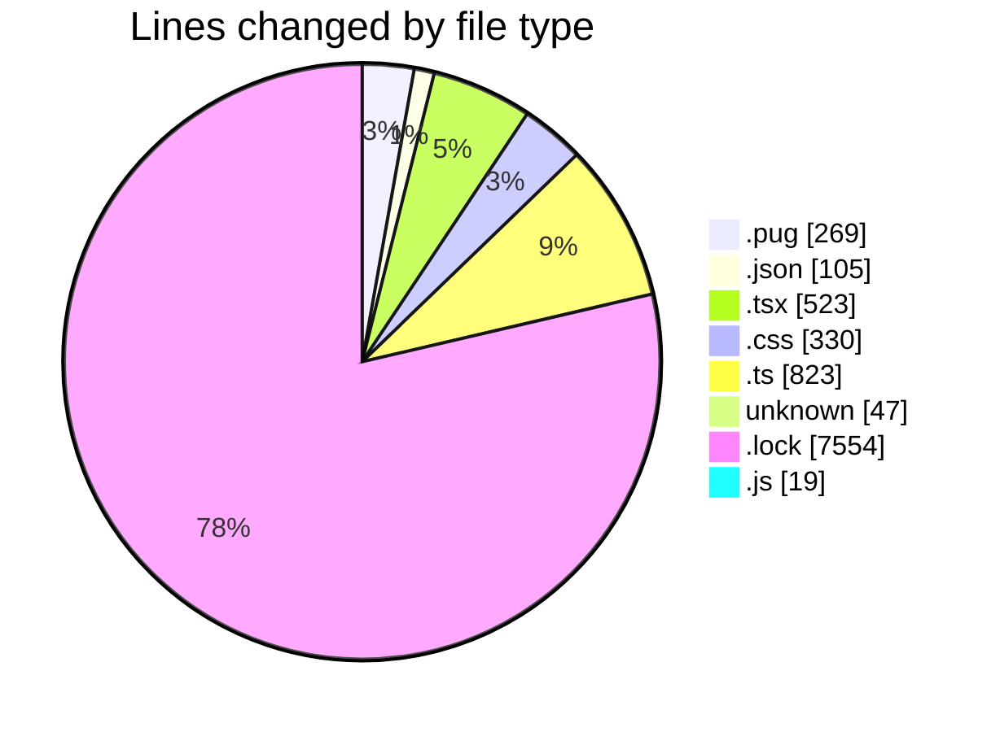
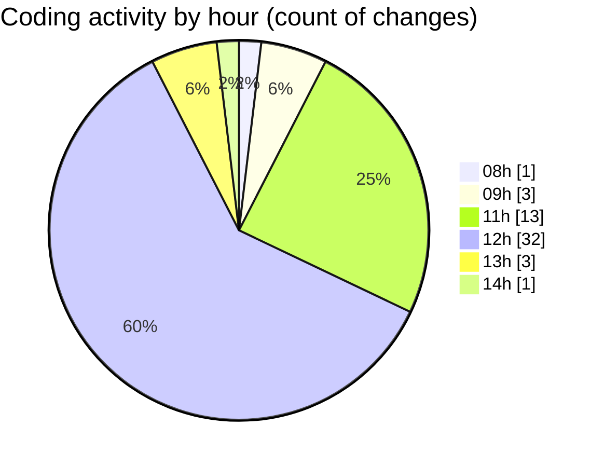

# cda - Activity Summary 

## Overall Statistics

| Stat                   | Value                                                             |
| ---------------------- | ----------------------------------------------------------------- |
| **Lines Added** (➕)   | 9475                                          |
| **Lines Removed** (➖) | 195                                        |
| **Net Change** (↕)    | 9280                |
| **Active Time** (⌚)   | 56 minutes |

## Modified Files
- **html.pug** (+212, -57)
- **calendar.json** (+20, -4)
- **Home.tsx** (+339, -122)
- **style.css** (+318, -12)
- **emails.ts** (+196, -0)
- **emails.test.ts** (+614, -0)
- **.env** (+47, -0)
- **package.json** (+61, -0)
- **yarn.lock** (+7554, -0)
- **MockS3Service.d.ts** (+13, -0)
- **MockS3Service.js** (+19, -0)
- **package.json** (+20, -0)
- **index.tsx** (+62, -0)

## Visualizations

### By File Type (Lines Changed)

### By Hour (Estimated Activity Count)

> **Last Updated:** 04/11/2025, 14:09:52