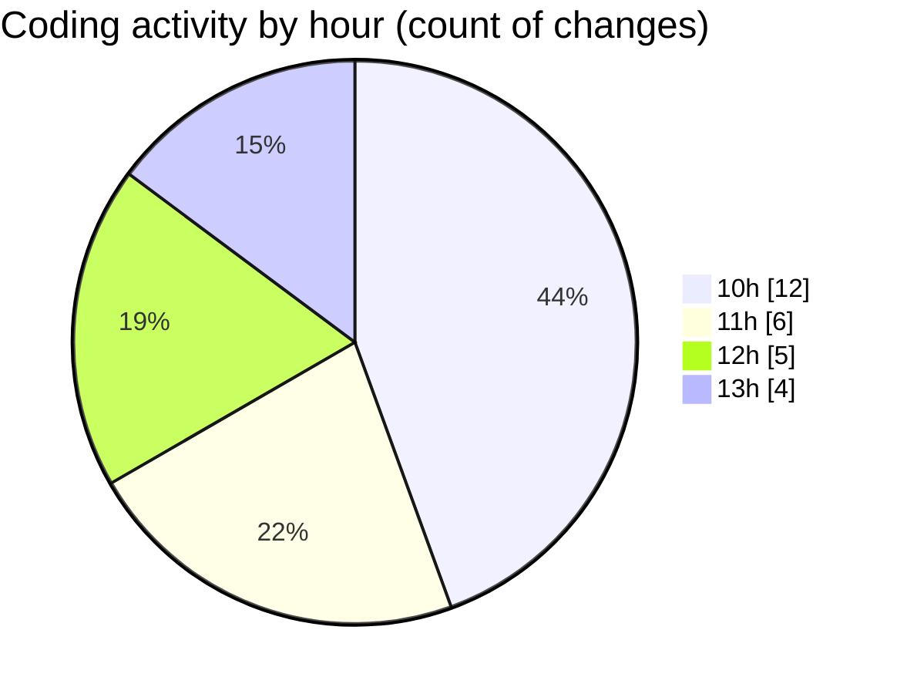

# cda - Activity Summary 

## Overall Statistics

| Stat                   | Value                                                             |
| ---------------------- | ----------------------------------------------------------------- |
| **Lines Added** (➕)   | 2166                                          |
| **Lines Removed** (➖) | 27                                        |
| **Net Change** (↕)    | 2139                |
| **Active Time** (⌚)   | 30 minutes |

## Modified Files
- **html.pug** (+76, -5)
- **style.css** (+342, -22)
- **infrastructure.json** (+176, -0)
- **package.json** (+62, -0)
- **calendar.ts** (+971, -0)
- **calendar.js** (+322, -0)
- **Home.tsx** (+217, -0)

## Visualizations

### By File Type (Lines Changed)

### By Hour (Estimated Activity Count)

> **Last Updated:** 05/11/2025, 13:40:52