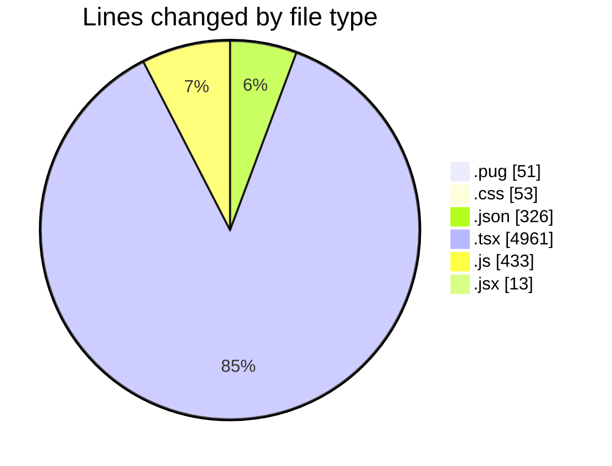
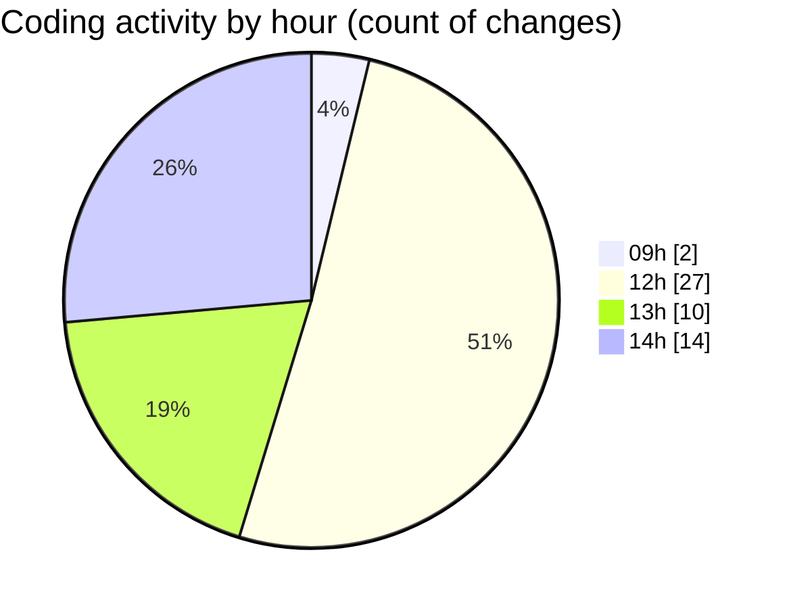

# cda - Activity Summary 

## Overall Statistics

| Stat                   | Value                                                             |
| ---------------------- | ----------------------------------------------------------------- |
| **Lines Added** (➕)   | 5779                                          |
| **Lines Removed** (➖) | 58                                        |
| **Net Change** (↕)    | 5721                |
| **Active Time** (⌚)   | 67 minutes |

## Modified Files
- **html.pug** (+24, -27)
- **style.css** (+25, -28)
- **calendar.json** (+21, -3)
- **lambda.json** (+217, -0)
- **package.json** (+85, -0)
- **App.tsx** (+61, -0)
- **index.tsx** (+57, -0)
- **DeleteEventWrapper.test.tsx** (+125, -0)
- **DeleteEventWrapper.tsx** (+54, -0)
- **DuplicateEventWrapper.test.tsx** (+100, -0)
- **DuplicateEventWrapper.tsx** (+29, -0)
- **NextEventNotification.test.js** (+433, -0)
- **NextEventNotification.tsx** (+107, -0)
- **ScrollToTop.jsx** (+13, -0)
- **EventForm.test.tsx** (+923, -0)
- **EventForm.tsx** (+1164, -0)
- **EventPage.test.tsx** (+1511, -0)
- **EventPage.tsx** (+437, -0)
- **MyEvents.test.tsx** (+179, -0)
- **ProviderRouterTest.tsx** (+55, -0)
- **ScrollableDatepicker.tsx** (+159, -0)

## Visualizations

### By File Type (Lines Changed)

### By Hour (Estimated Activity Count)

> **Last Updated:** 06/11/2025, 14:33:45