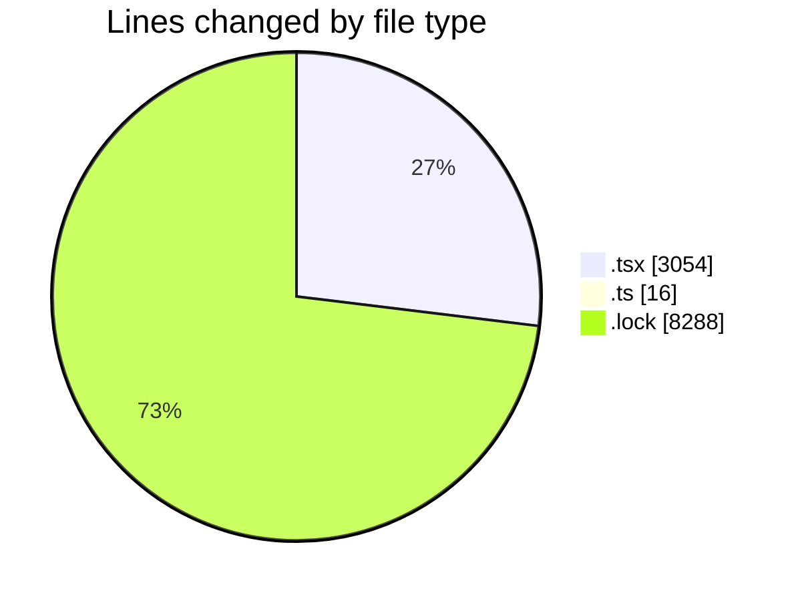
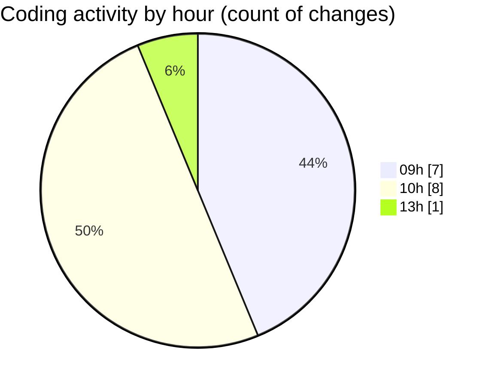

# cda - Activity Summary 

## Overall Statistics

| Stat                   | Value                                                             |
| ---------------------- | ----------------------------------------------------------------- |
| **Lines Added** (➕)   | 11350                                          |
| **Lines Removed** (➖) | 8                                        |
| **Net Change** (↕)    | 11342                |
| **Active Time** (⌚)   | 12 minutes |

## Modified Files
- **EventForm.test.tsx** (+2779, -8)
- **setupTests.ts** (+16, -0)
- **Footer.tsx** (+186, -0)
- **yarn.lock** (+8288, -0)
- **ShareEventModal.tsx** (+81, -0)

## Visualizations

### By File Type (Lines Changed)

### By Hour (Estimated Activity Count)

> **Last Updated:** 07/11/2025, 13:26:41