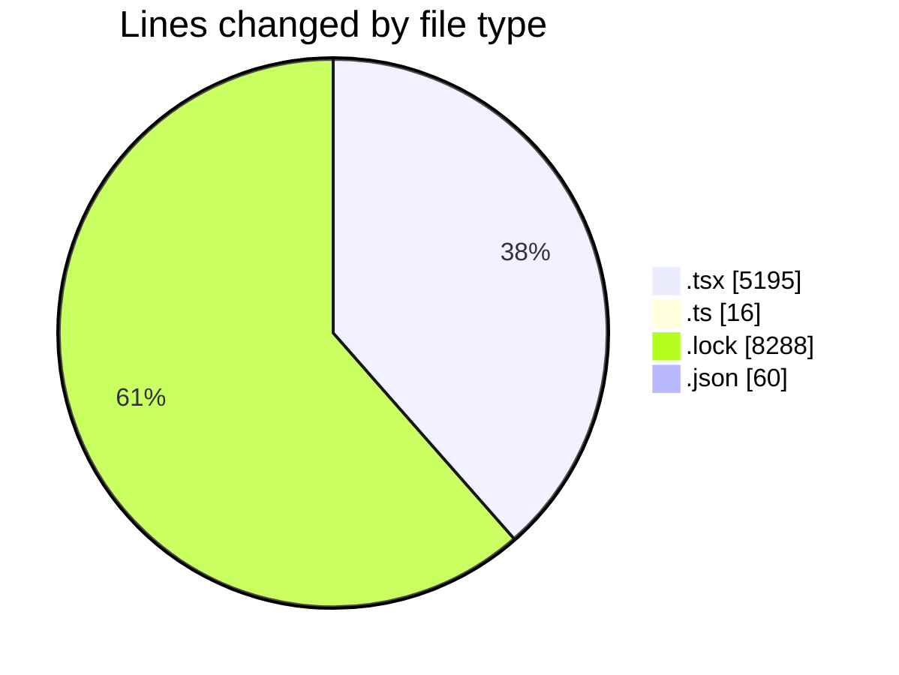
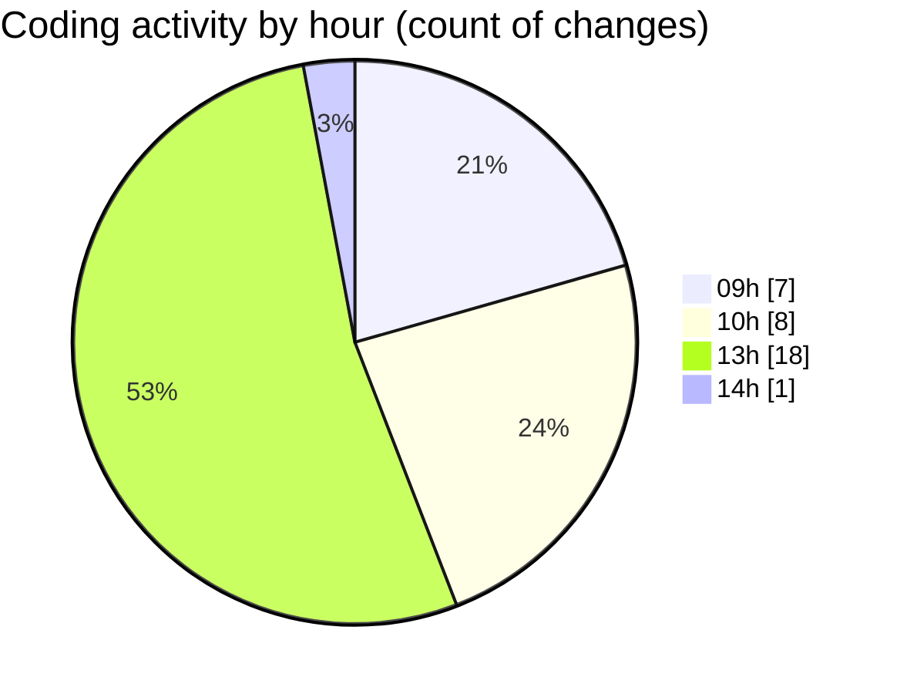

# cda - Activity Summary 

## Overall Statistics

| Stat                   | Value                                                             |
| ---------------------- | ----------------------------------------------------------------- |
| **Lines Added** (➕)   | 12599                                          |
| **Lines Removed** (➖) | 960                                        |
| **Net Change** (↕)    | 11639                |
| **Active Time** (⌚)   | 37 minutes |

## Modified Files
- **EventForm.test.tsx** (+3707, -931)
- **setupTests.ts** (+16, -0)
- **Footer.tsx** (+186, -0)
- **yarn.lock** (+8288, -0)
- **ShareEventModal.tsx** (+81, -1)
- **MyEvents.tsx** (+124, -26)
- **settings.json** (+58, -2)
- **DevelopPanel.tsx** (+139, -0)

## Visualizations

### By File Type (Lines Changed)

### By Hour (Estimated Activity Count)

> **Last Updated:** 07/11/2025, 14:01:41