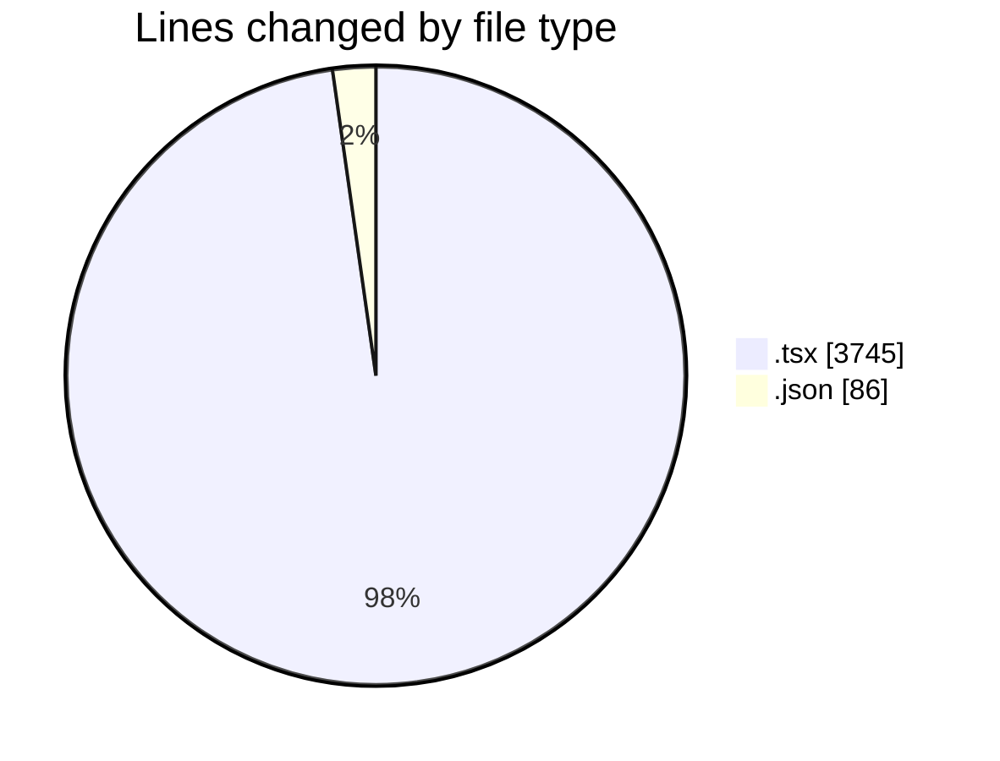
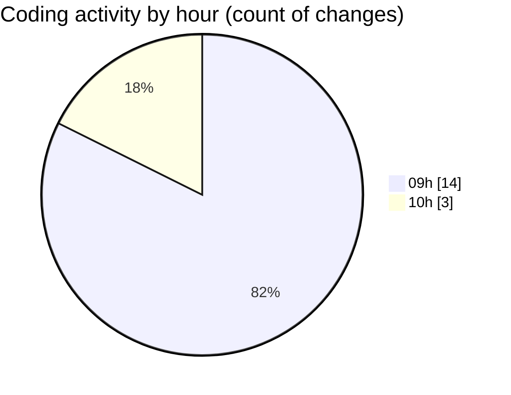

# cda - Activity Summary 

## Overall Statistics

| Stat                   | Value                                                             |
| ---------------------- | ----------------------------------------------------------------- |
| **Lines Added** (➕)   | 3811                                          |
| **Lines Removed** (➖) | 20                                        |
| **Net Change** (↕)    | 3791                |
| **Active Time** (⌚)   | 11 minutes |

## Modified Files
- **MyEvents.tsx** (+235, -13)
- **ShareEventModal.tsx** (+2, -1)
- **DeleteEventWrapper.test.tsx** (+125, -0)
- **EventPage.test.tsx** (+1511, -0)
- **EventForm.test.tsx** (+1852, -6)
- **settings.json** (+1, -0)
- **package.json** (+85, -0)

## Visualizations

### By File Type (Lines Changed)

### By Hour (Estimated Activity Count)

> **Last Updated:** 10/11/2025, 10:44:25