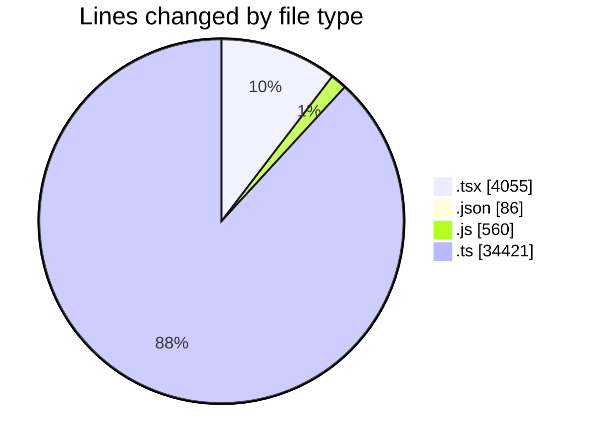
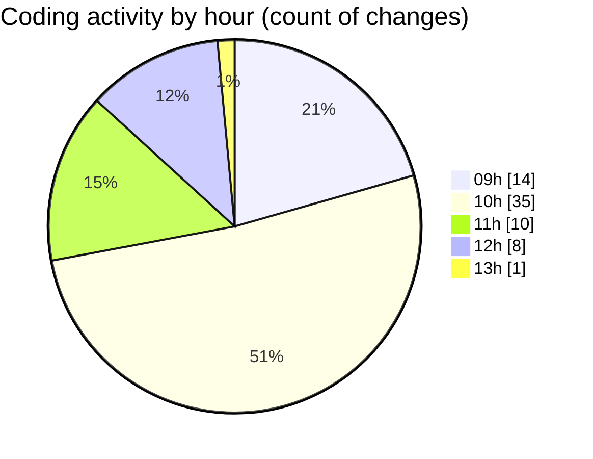

# cda - Activity Summary 

## Overall Statistics

| Stat                   | Value                                                             |
| ---------------------- | ----------------------------------------------------------------- |
| **Lines Added** (➕)   | 38944                                          |
| **Lines Removed** (➖) | 178                                        |
| **Net Change** (↕)    | 38766                |
| **Active Time** (⌚)   | 78 minutes |

## Modified Files
- **MyEvents.tsx** (+261, -52)
- **ShareEventModal.tsx** (+2, -1)
- **DeleteEventWrapper.test.tsx** (+125, -0)
- **EventPage.test.tsx** (+1511, -0)
- **EventForm.test.tsx** (+1868, -19)
- **settings.json** (+1, -0)
- **package.json** (+85, -0)
- **App.js** (+221, -5)
- **graphql.ts** (+6200, -0)
- **gql.ts** (+424, -0)
- **skill-mutations.ts** (+595, -12)
- **views.ts** (+8765, -35)
- **resolvers-types.ts** (+10069, -0)
- **skill-queries.ts** (+200, -0)
- **skills.ts** (+222, -46)
- **sub-skill-mutations.ts** (+192, -0)
- **skills.js** (+334, -0)
- **index.tsx** (+69, -8)
- **graphql.ts** (+7386, -0)
- **skill-admin-mutations.ts** (+275, -0)
- **DevelopPanel.tsx** (+139, -0)

## Visualizations

### By File Type (Lines Changed)

### By Hour (Estimated Activity Count)

> **Last Updated:** 10/11/2025, 13:39:25