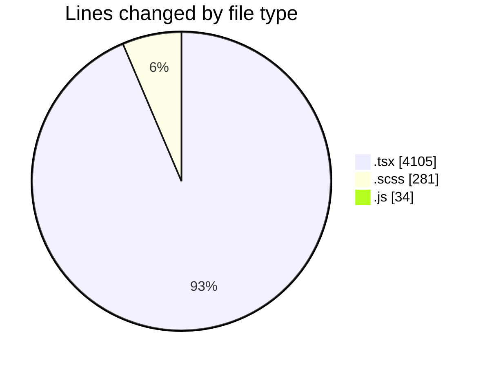
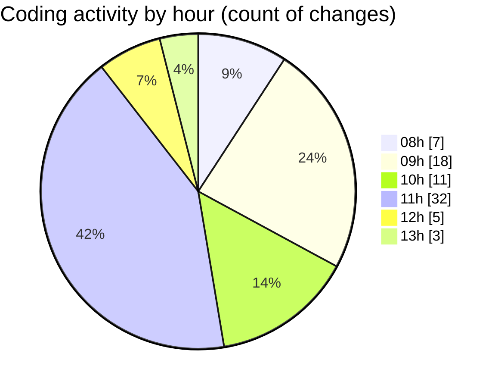

# cda - Activity Summary 

## Overall Statistics

| Stat                   | Value                                                             |
| ---------------------- | ----------------------------------------------------------------- |
| **Lines Added** (➕)   | 4220                                          |
| **Lines Removed** (➖) | 200                                        |
| **Net Change** (↕)    | 4020                |
| **Active Time** (⌚)   | 109 minutes |

## Modified Files
- **CapacityBadge.test.tsx** (+337, -43)
- **CapacityBadge.tsx** (+145, -34)
- **EventPage.tsx** (+979, -97)
- **EventForm.test.tsx** (+940, -7)
- **EventPage.test.tsx** (+1517, -6)
- **EventPage.scss** (+273, -8)
- **20251111130619-alter-calendar-event-table.js** (+17, -5)
- **20251029101734-alter-calendar-event-table.js** (+12, -0)

## Visualizations

### By File Type (Lines Changed)

### By Hour (Estimated Activity Count)

> **Last Updated:** 11/11/2025, 13:10:50