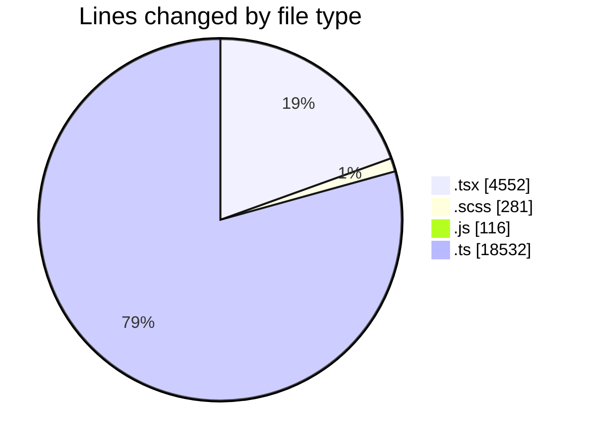
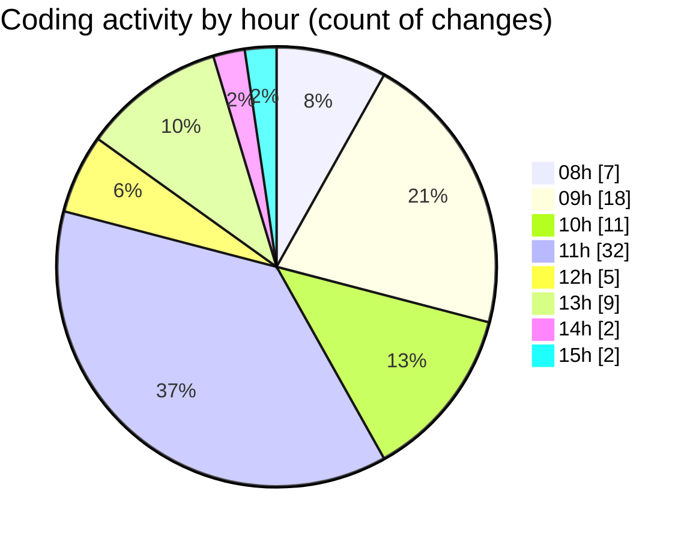

# cda - Activity Summary 

## Overall Statistics

| Stat                   | Value                                                             |
| ---------------------- | ----------------------------------------------------------------- |
| **Lines Added** (➕)   | 23254                                          |
| **Lines Removed** (➖) | 227                                        |
| **Net Change** (↕)    | 23027                |
| **Active Time** (⌚)   | 117 minutes |

## Modified Files
- **CapacityBadge.test.tsx** (+337, -43)
- **CapacityBadge.tsx** (+145, -34)
- **EventPage.tsx** (+1426, -97)
- **EventForm.test.tsx** (+940, -7)
- **EventPage.test.tsx** (+1517, -6)
- **EventPage.scss** (+273, -8)
- **20251111130619-alter-calendar-event-table.js** (+17, -5)
- **20251029101734-alter-calendar-event-table.js** (+12, -0)
- **20251111131833-alter-calendar-event-view.js** (+82, -0)
- **clear_view_views.ts** (+3710, -0)
- **tables.ts** (+6030, -0)
- **views.ts** (+8765, -27)

## Visualizations

### By File Type (Lines Changed)

### By Hour (Estimated Activity Count)

> **Last Updated:** 11/11/2025, 15:38:30