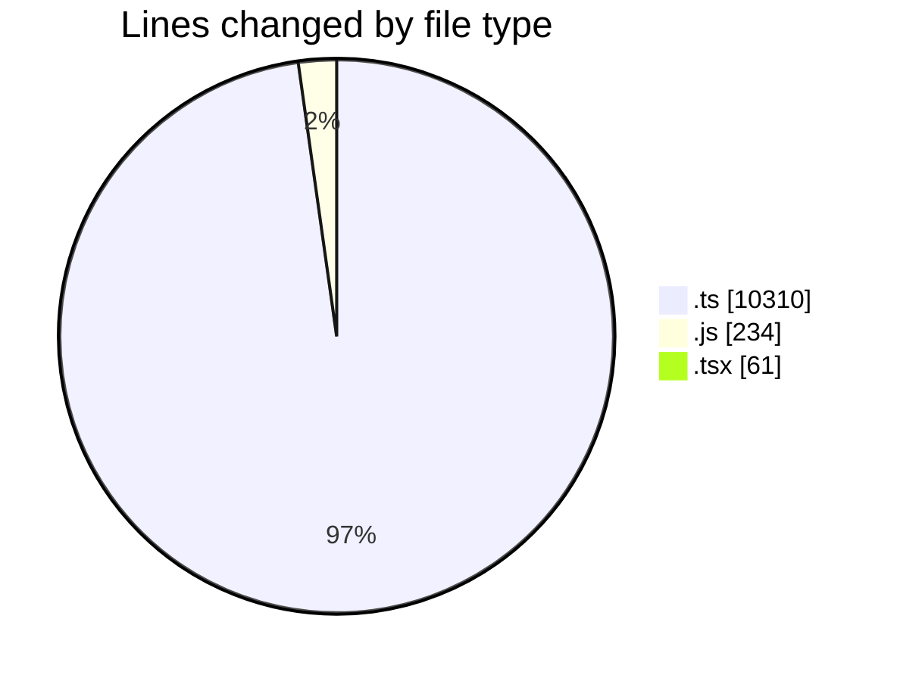
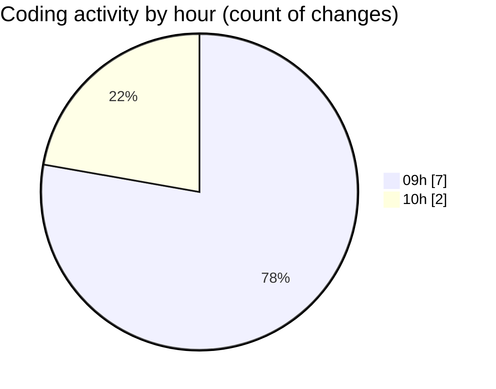

# cda - Activity Summary 

## Overall Statistics

| Stat                   | Value                                                             |
| ---------------------- | ----------------------------------------------------------------- |
| **Lines Added** (➕)   | 10509                                          |
| **Lines Removed** (➖) | 96                                        |
| **Net Change** (↕)    | 10413                |
| **Active Time** (⌚)   | 4 minutes |

## Modified Files
- **calendar-mutations.ts** (+0, -16)
- **calendar.ts** (+0, -28)
- **calendar-queries.ts** (+0, -50)
- **checkUserPermissions.test.ts** (+143, -0)
- **emails.test.ts** (+0, -1)
- **iCalendar.test.ts** (+0, -1)
- **resolvers-types.ts** (+10071, -0)
- **App.js** (+234, -0)
- **index.tsx** (+61, -0)

## Visualizations

### By File Type (Lines Changed)

### By Hour (Estimated Activity Count)

> **Last Updated:** 12/11/2025, 10:15:00