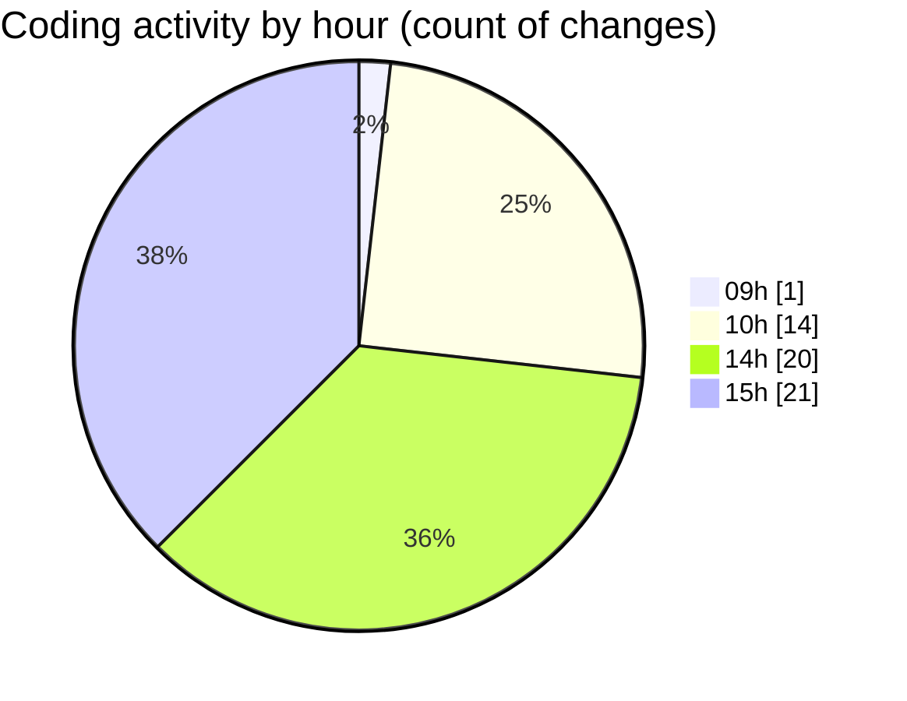

# cda - Activity Summary 

## Overall Statistics

| Stat                   | Value                                                             |
| ---------------------- | ----------------------------------------------------------------- |
| **Lines Added** (➕)   | 24956                                          |
| **Lines Removed** (➖) | 422                                        |
| **Net Change** (↕)    | 24534                |
| **Active Time** (⌚)   | 77 minutes |

## Modified Files
- **.env** (+144, -0)
- **settings.json** (+59, -0)
- **calendar-queries.ts** (+3268, -103)
- **calendar-mutations.ts** (+6860, -178)
- **calendar.ts** (+1986, -8)
- **calendar.js** (+651, -0)
- **resolvers-types.ts** (+10071, -0)
- **iCalendar.test.ts** (+150, -0)
- **emails.test.ts** (+801, -0)
- **AddAttendeeModal.tsx** (+273, -15)
- **EventPage.tsx** (+447, -0)
- **Register.tsx** (+246, -118)

## Visualizations

### By File Type (Lines Changed)

### By Hour (Estimated Activity Count)

> **Last Updated:** 13/11/2025, 15:33:59