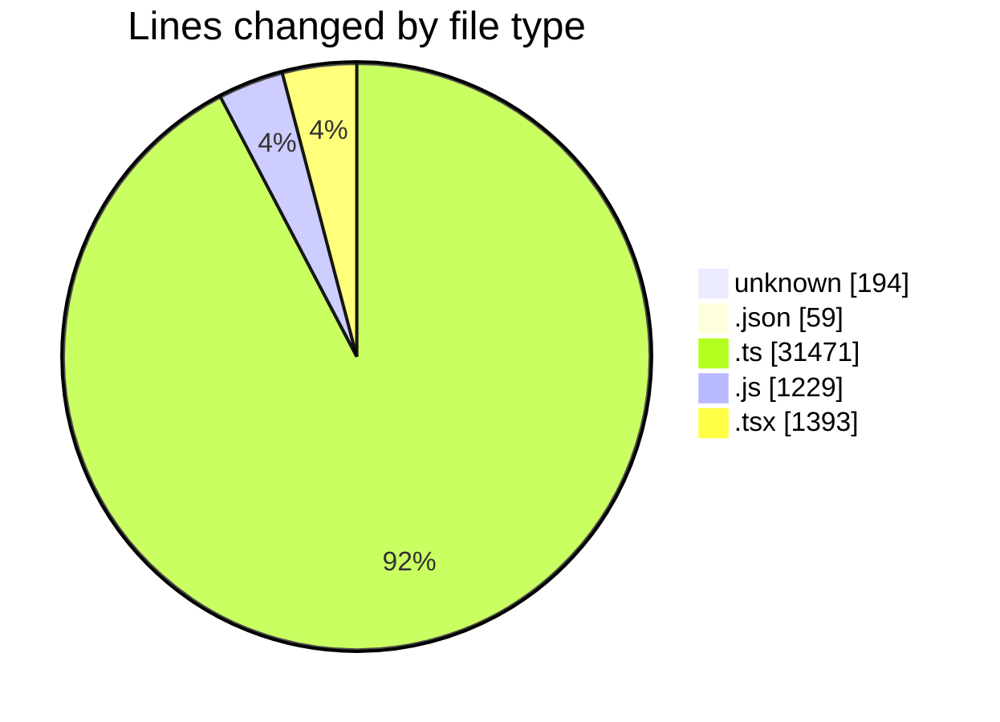
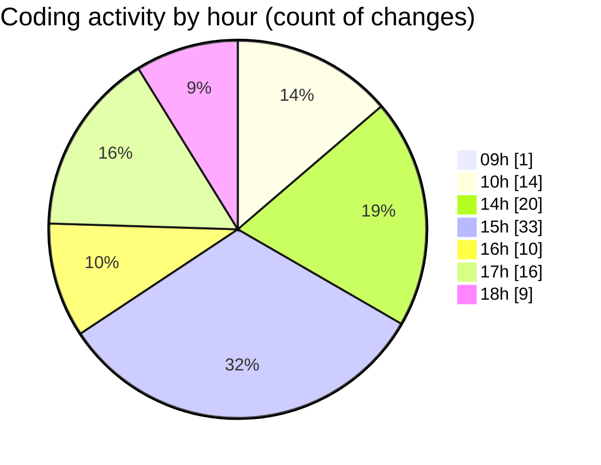

# cda - Activity Summary 

## Overall Statistics

| Stat                   | Value                                                             |
| ---------------------- | ----------------------------------------------------------------- |
| **Lines Added** (➕)   | 33547                                          |
| **Lines Removed** (➖) | 799                                        |
| **Net Change** (↕)    | 32748                |
| **Active Time** (⌚)   | 142 minutes |

## Modified Files
- **.env** (+194, -0)
- **settings.json** (+59, -0)
- **calendar-queries.ts** (+4902, -206)
- **calendar-mutations.ts** (+10468, -356)
- **calendar.ts** (+4080, -86)
- **calendar.js** (+987, -7)
- **resolvers-types.ts** (+10071, -0)
- **iCalendar.test.ts** (+150, -0)
- **emails.test.ts** (+801, -0)
- **AddAttendeeModal.tsx** (+273, -15)
- **EventPage.tsx** (+447, -0)
- **Register.tsx** (+256, -120)
- **SearchUser.tsx** (+56, -0)
- **SkillUsersModal.tsx** (+37, -0)
- **App.js** (+233, -2)
- **index.tsx** (+189, -0)
- **index.ts** (+202, -0)
- **group-member-queries.ts** (+142, -7)

## Visualizations

### By File Type (Lines Changed)

### By Hour (Estimated Activity Count)

> **Last Updated:** 13/11/2025, 18:09:02