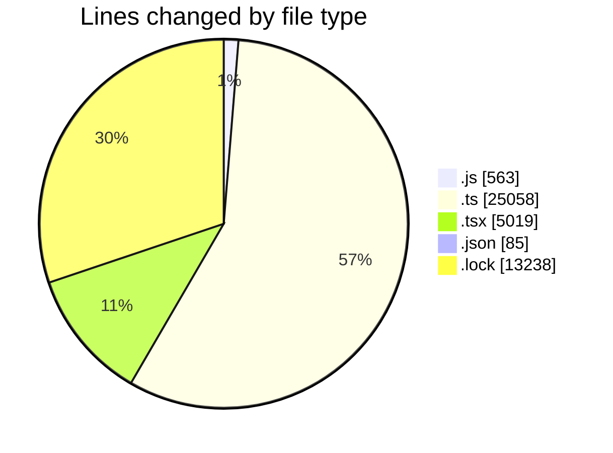
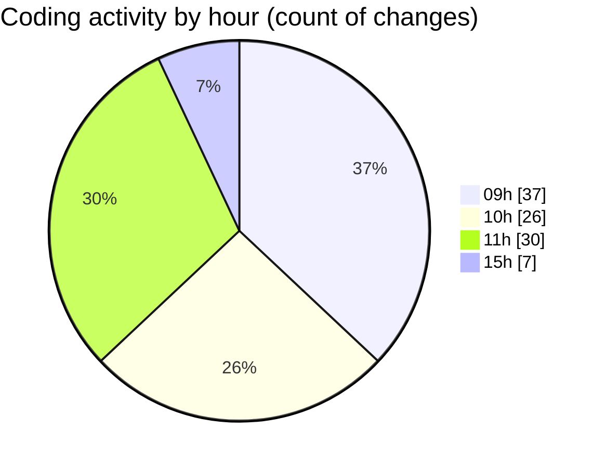

# cda - Activity Summary 

## Overall Statistics

| Stat                   | Value                                                             |
| ---------------------- | ----------------------------------------------------------------- |
| **Lines Added** (➕)   | 43736                                          |
| **Lines Removed** (➖) | 227                                        |
| **Net Change** (↕)    | 43509                |
| **Active Time** (⌚)   | 161 minutes |

## Modified Files
- **calendar.js** (+329, -0)
- **App.js** (+234, -0)
- **everywhere-queries.ts** (+215, -0)
- **calendar.ts** (+1026, -0)
- **calendar-mutations.ts** (+3432, -0)
- **group-member-queries.ts** (+142, -0)
- **group-mutations.ts** (+378, -0)
- **group-queries.ts** (+302, -0)
- **system.ts** (+139, -0)
- **index.ts** (+207, -1)
- **Home.tsx** (+218, -1)
- **eventFaker.ts** (+58, -0)
- **NextEventNotification.test.tsx** (+441, -8)
- **graphql.ts** (+7019, -0)
- **gql.ts** (+43, -0)
- **AddAttendeeModal.test.tsx** (+519, -0)
- **DeleteEventWrapper.tsx** (+72, -18)
- **refetchEvents.ts** (+41, -0)
- **EventForm.test.tsx** (+1866, -0)
- **gql.ts** (+196, -0)
- **graphql.ts** (+11852, -0)
- **Register.tsx** (+495, -181)
- **EventForm.tsx** (+1182, -18)
- **global.d.ts** (+7, -0)
- **package.json** (+85, -0)
- **yarn.lock** (+13238, -0)

## Visualizations

### By File Type (Lines Changed)

### By Hour (Estimated Activity Count)

> **Last Updated:** 14/11/2025, 15:38:44