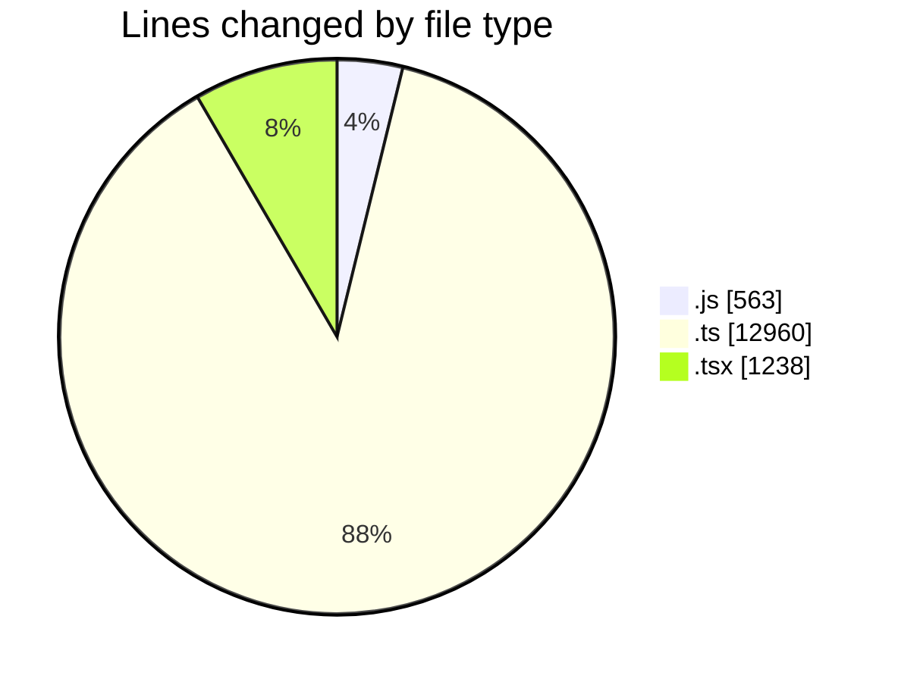

# cda - Activity Summary 

## Overall Statistics

| Stat                   | Value                                                             |
| ---------------------- | ----------------------------------------------------------------- |
| **Lines Added** (➕)   | 14753                                          |
| **Lines Removed** (➖) | 8                                        |
| **Net Change** (↕)    | 14745                |
| **Active Time** (⌚)   | 41 minutes |

## Modified Files
- **calendar.js** (+329, -0)
- **App.js** (+234, -0)
- **everywhere-queries.ts** (+215, -0)
- **calendar.ts** (+1026, -0)
- **calendar-mutations.ts** (+3432, -0)
- **group-member-queries.ts** (+142, -0)
- **group-mutations.ts** (+378, -0)
- **group-queries.ts** (+302, -0)
- **system.ts** (+139, -0)
- **index.ts** (+205, -1)
- **Home.tsx** (+218, -0)
- **eventFaker.ts** (+58, -0)
- **NextEventNotification.test.tsx** (+434, -1)
- **graphql.ts** (+7019, -0)
- **gql.ts** (+43, -0)
- **AddAttendeeModal.test.tsx** (+519, -0)
- **DeleteEventWrapper.tsx** (+60, -6)

## Visualizations

### By File Type (Lines Changed)

### By Hour (Estimated Activity Count)

> **Last Updated:** 14/11/2025, 09:43:20