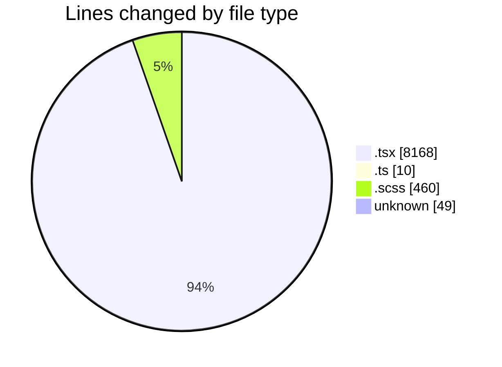
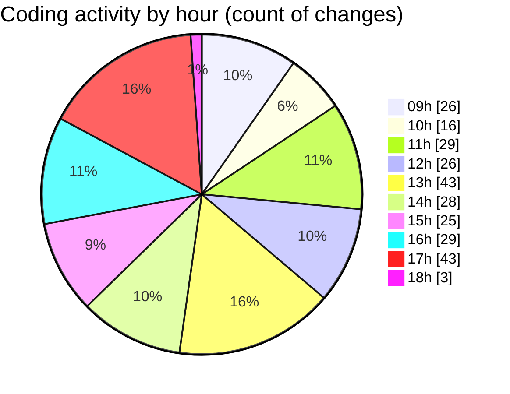

# cda - Activity Summary 

## Overall Statistics

| Stat                   | Value                                                             |
| ---------------------- | ----------------------------------------------------------------- |
| **Lines Added** (➕)   | 8021                                          |
| **Lines Removed** (➖) | 666                                        |
| **Net Change** (↕)    | 7355                |
| **Active Time** (⌚)   | 405 minutes |

## Modified Files
- **EventForm.tsx** (+2512, -147)
- **EventPage.tsx** (+472, -13)
- **index.ts** (+3, -0)
- **PublishEvent.test.tsx** (+152, -80)
- **PublishEvent.tsx** (+95, -53)
- **EventPage.scss** (+282, -11)
- **Register.tsx** (+150, -31)
- **global.d.ts** (+7, -0)
- **EventForm.scss** (+165, -2)
- **AddAttendeeModal.tsx** (+258, -0)
- **AddAttendeeModal.test.tsx** (+586, -28)
- **EventPage.test.tsx** (+1774, -105)
- **EventForm.test.tsx** (+976, -13)
- **MyEvents.tsx** (+138, -7)
- **MyEvents.test.tsx** (+402, -176)
- **.env** (+49, -0)

## Visualizations

### By File Type (Lines Changed)

### By Hour (Estimated Activity Count)

> **Last Updated:** 17/11/2025, 18:04:57