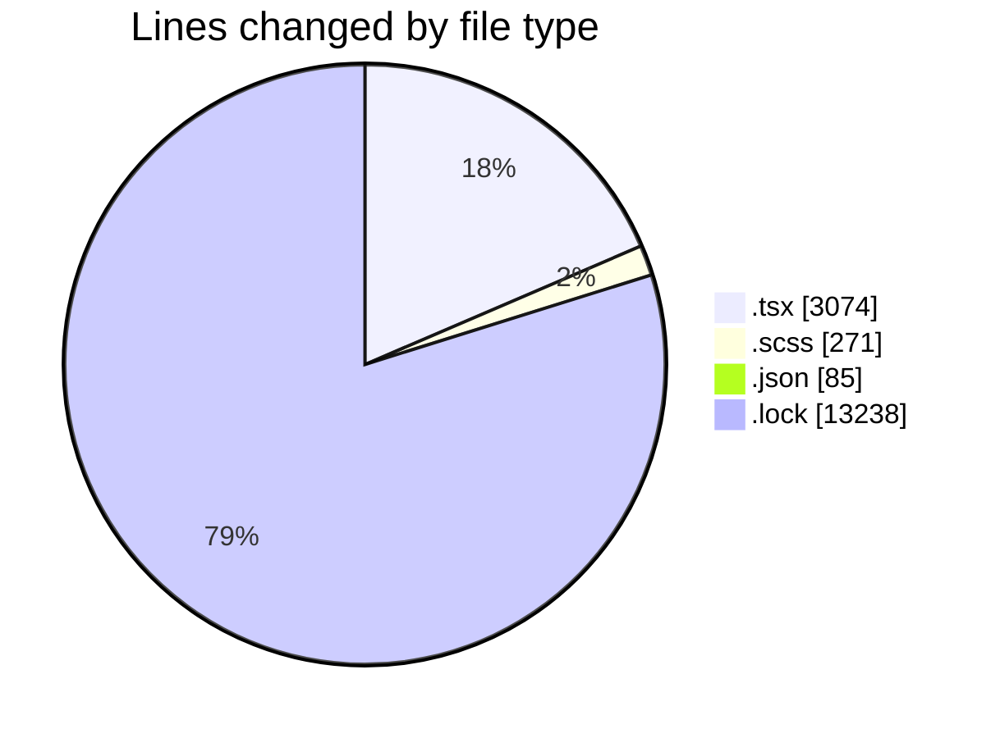
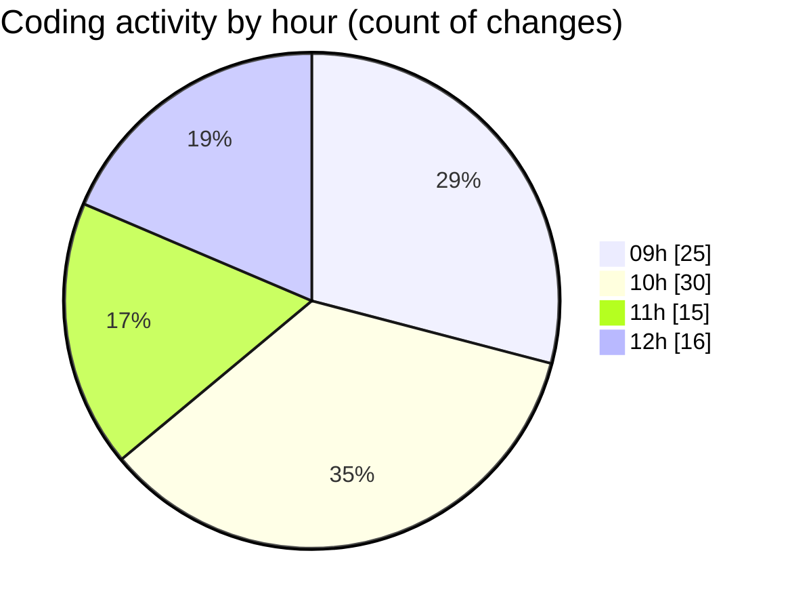

# cda - Activity Summary 

## Overall Statistics

| Stat                   | Value                                                             |
| ---------------------- | ----------------------------------------------------------------- |
| **Lines Added** (➕)   | 16475                                          |
| **Lines Removed** (➖) | 193                                        |
| **Net Change** (↕)    | 16282                |
| **Active Time** (⌚)   | 133 minutes |

## Modified Files
- **MyEvents.test.tsx** (+63, -65)
- **MyEvents.tsx** (+138, -18)
- **AddAttendeeModal.tsx** (+258, -0)
- **AddAttendeeModal.test.tsx** (+558, -0)
- **EventPage.scss** (+271, -0)
- **EventPage.test.tsx** (+1811, -110)
- **ProviderRouterTest.tsx** (+53, -0)
- **package.json** (+85, -0)
- **yarn.lock** (+13238, -0)

## Visualizations

### By File Type (Lines Changed)

### By Hour (Estimated Activity Count)

> **Last Updated:** 18/11/2025, 12:20:02