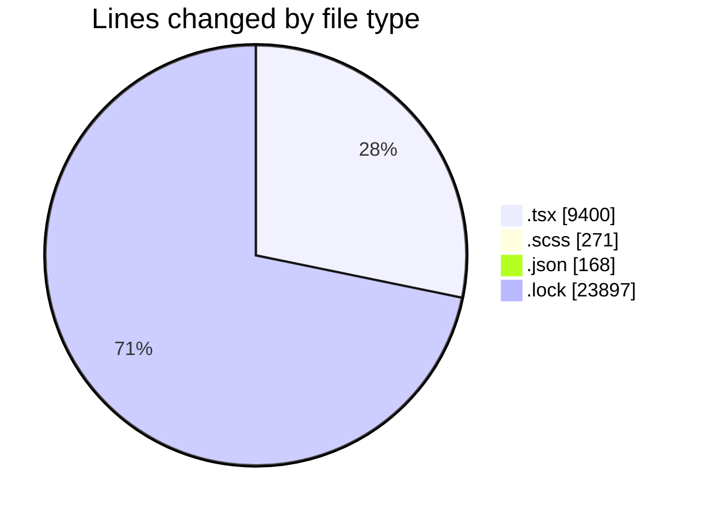
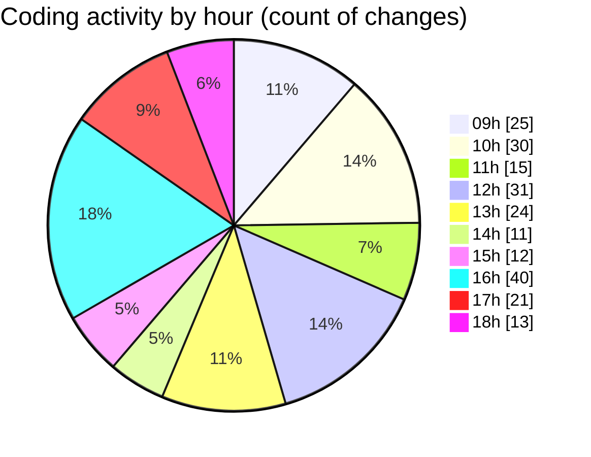

# cda - Activity Summary 

## Overall Statistics

| Stat                   | Value                                                             |
| ---------------------- | ----------------------------------------------------------------- |
| **Lines Added** (➕)   | 33293                                          |
| **Lines Removed** (➖) | 443                                        |
| **Net Change** (↕)    | 32850                |
| **Active Time** (⌚)   | 335 minutes |

## Modified Files
- **MyEvents.test.tsx** (+63, -65)
- **MyEvents.tsx** (+138, -18)
- **AddAttendeeModal.tsx** (+519, -0)
- **AddAttendeeModal.test.tsx** (+558, -0)
- **EventPage.scss** (+271, -0)
- **EventPage.test.tsx** (+3550, -142)
- **ProviderRouterTest.tsx** (+53, -6)
- **package.json** (+85, -0)
- **yarn.lock** (+13238, -0)
- **index.tsx** (+136, -14)
- **EventForm.test.tsx** (+2055, -123)
- **package.json** (+62, -0)
- **yarn.lock** (+7603, -0)
- **package.json** (+21, -0)
- **yarn.lock** (+3056, -0)
- **EventForm.tsx** (+1245, -53)
- **NextEventNotification.test.tsx** (+439, -0)
- **Register.tsx** (+135, -12)
- **DeleteEventWrapper.tsx** (+66, -10)

## Visualizations

### By File Type (Lines Changed)

### By Hour (Estimated Activity Count)

> **Last Updated:** 18/11/2025, 18:53:13